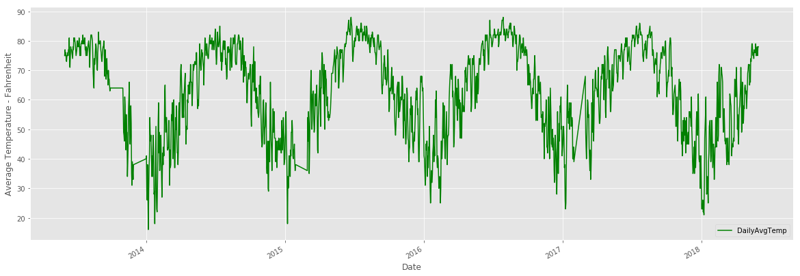
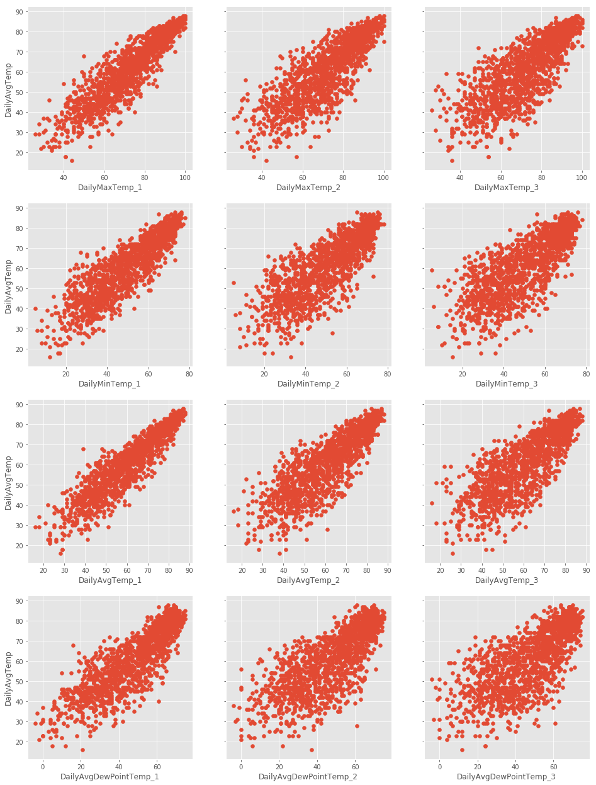
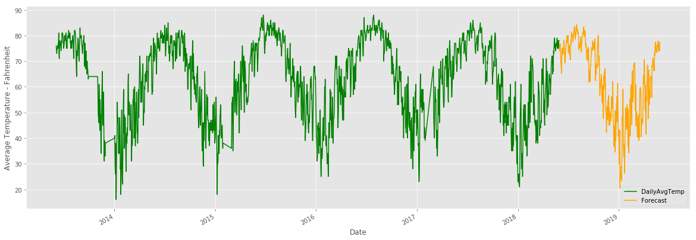

***
# <font color=purple>**Using Machine Learning To Predict Local Weather**</font> 
***


```python
import pandas as pd
import numpy as np
import datetime
import matplotlib  
import matplotlib.pyplot as plt
import seaborn as sns
import statsmodels.api as sm
from sklearn.model_selection import train_test_split
from sklearn.linear_model import LinearRegression  
from sklearn.metrics import mean_absolute_error, median_absolute_error
from sklearn.preprocessing import StandardScaler
matplotlib.style.use('ggplot')
```

## Raw Data Preview

#### Charlotte, NC Climate Data from 2013 to 2018 (downloaded from the NOAA NCEI site - https://www.ncei.noaa.gov/)


```python
clt_climate_df = pd.read_csv("All Datasets/Charlotte_climate_info_2013_to_2018.csv", low_memory=False)
clt_climate_df.head()
```


<div>
<style scoped>
    .dataframe tbody tr th:only-of-type {
        vertical-align: middle;
    }

    .dataframe tbody tr th {
        vertical-align: top;
    }

    .dataframe thead th {
        text-align: right;
    }
</style>
<table border="1" class="dataframe">
  <thead>
    <tr style="text-align: right;">
      <th></th>
      <th>STATION</th>
      <th>STATION_NAME</th>
      <th>ELEVATION</th>
      <th>LATITUDE</th>
      <th>LONGITUDE</th>
      <th>DATE</th>
      <th>REPORTTPYE</th>
      <th>HOURLYSKYCONDITIONS</th>
      <th>HOURLYVISIBILITY</th>
      <th>HOURLYPRSENTWEATHERTYPE</th>
      <th>...</th>
      <th>MonthlyMaxSeaLevelPressureTime</th>
      <th>MonthlyMinSeaLevelPressureValue</th>
      <th>MonthlyMinSeaLevelPressureDate</th>
      <th>MonthlyMinSeaLevelPressureTime</th>
      <th>MonthlyTotalHeatingDegreeDays</th>
      <th>MonthlyTotalCoolingDegreeDays</th>
      <th>MonthlyDeptFromNormalHeatingDD</th>
      <th>MonthlyDeptFromNormalCoolingDD</th>
      <th>MonthlyTotalSeasonToDateHeatingDD</th>
      <th>MonthlyTotalSeasonToDateCoolingDD</th>
    </tr>
  </thead>
  <tbody>
    <tr>
      <th>0</th>
      <td>WBAN:13881</td>
      <td>CHARLOTTE DOUGLAS AIRPORT NC US</td>
      <td>221.9</td>
      <td>35.2236</td>
      <td>-80.9552</td>
      <td>6/1/2013 0:52</td>
      <td>FM-15</td>
      <td>FEW:02 55 SCT:04 250</td>
      <td>10</td>
      <td>NaN</td>
      <td>...</td>
      <td>-9999</td>
      <td>NaN</td>
      <td>-9999</td>
      <td>-9999</td>
      <td>NaN</td>
      <td>NaN</td>
      <td>NaN</td>
      <td>NaN</td>
      <td>NaN</td>
      <td>NaN</td>
    </tr>
    <tr>
      <th>1</th>
      <td>WBAN:13881</td>
      <td>CHARLOTTE DOUGLAS AIRPORT NC US</td>
      <td>221.9</td>
      <td>35.2236</td>
      <td>-80.9552</td>
      <td>6/1/2013 1:00</td>
      <td>FM-12</td>
      <td>NaN</td>
      <td>NaN</td>
      <td>NaN</td>
      <td>...</td>
      <td>-9999</td>
      <td>NaN</td>
      <td>-9999</td>
      <td>-9999</td>
      <td>NaN</td>
      <td>NaN</td>
      <td>NaN</td>
      <td>NaN</td>
      <td>NaN</td>
      <td>NaN</td>
    </tr>
    <tr>
      <th>2</th>
      <td>WBAN:13881</td>
      <td>CHARLOTTE DOUGLAS AIRPORT NC US</td>
      <td>221.9</td>
      <td>35.2236</td>
      <td>-80.9552</td>
      <td>6/1/2013 1:52</td>
      <td>FM-15</td>
      <td>BKN:07 65</td>
      <td>10</td>
      <td>NaN</td>
      <td>...</td>
      <td>-9999</td>
      <td>NaN</td>
      <td>-9999</td>
      <td>-9999</td>
      <td>NaN</td>
      <td>NaN</td>
      <td>NaN</td>
      <td>NaN</td>
      <td>NaN</td>
      <td>NaN</td>
    </tr>
    <tr>
      <th>3</th>
      <td>WBAN:13881</td>
      <td>CHARLOTTE DOUGLAS AIRPORT NC US</td>
      <td>221.9</td>
      <td>35.2236</td>
      <td>-80.9552</td>
      <td>6/1/2013 2:52</td>
      <td>FM-15</td>
      <td>BKN:07 75</td>
      <td>10</td>
      <td>NaN</td>
      <td>...</td>
      <td>-9999</td>
      <td>NaN</td>
      <td>-9999</td>
      <td>-9999</td>
      <td>NaN</td>
      <td>NaN</td>
      <td>NaN</td>
      <td>NaN</td>
      <td>NaN</td>
      <td>NaN</td>
    </tr>
    <tr>
      <th>4</th>
      <td>WBAN:13881</td>
      <td>CHARLOTTE DOUGLAS AIRPORT NC US</td>
      <td>221.9</td>
      <td>35.2236</td>
      <td>-80.9552</td>
      <td>6/1/2013 3:52</td>
      <td>FM-15</td>
      <td>FEW:02 75 SCT:04 110</td>
      <td>10</td>
      <td>NaN</td>
      <td>...</td>
      <td>-9999</td>
      <td>NaN</td>
      <td>-9999</td>
      <td>-9999</td>
      <td>NaN</td>
      <td>NaN</td>
      <td>NaN</td>
      <td>NaN</td>
      <td>NaN</td>
      <td>NaN</td>
    </tr>
  </tbody>
</table>
<p>5 rows × 90 columns</p>
</div>


## Data Preparation & Cleanup


```python
# list all the columns to determine which is needed
clt_climate_df.columns
```


    Index(['STATION', 'STATION_NAME', 'ELEVATION', 'LATITUDE', 'LONGITUDE', 'DATE',
           'REPORTTPYE', 'HOURLYSKYCONDITIONS', 'HOURLYVISIBILITY',
           'HOURLYPRSENTWEATHERTYPE', 'HOURLYDRYBULBTEMPF', 'HOURLYDRYBULBTEMPC',
           'HOURLYWETBULBTEMPF', 'HOURLYWETBULBTEMPC', 'HOURLYDewPointTempF',
           'HOURLYDewPointTempC', 'HOURLYRelativeHumidity', 'HOURLYWindSpeed',
           'HOURLYWindDirection', 'HOURLYWindGustSpeed', 'HOURLYStationPressure',
           'HOURLYPressureTendency', 'HOURLYPressureChange',
           'HOURLYSeaLevelPressure', 'HOURLYPrecip', 'HOURLYAltimeterSetting',
           'DAILYMaximumDryBulbTemp', 'DAILYMinimumDryBulbTemp',
           'DAILYAverageDryBulbTemp', 'DAILYDeptFromNormalAverageTemp',
           'DAILYAverageRelativeHumidity', 'DAILYAverageDewPointTemp',
           'DAILYAverageWetBulbTemp', 'DAILYHeatingDegreeDays',
           'DAILYCoolingDegreeDays', 'DAILYSunrise', 'DAILYSunset', 'DAILYWeather',
           'DAILYPrecip', 'DAILYSnowfall', 'DAILYSnowDepth',
           'DAILYAverageStationPressure', 'DAILYAverageSeaLevelPressure',
           'DAILYAverageWindSpeed', 'DAILYPeakWindSpeed', 'PeakWindDirection',
           'DAILYSustainedWindSpeed', 'DAILYSustainedWindDirection',
           'MonthlyMaximumTemp', 'MonthlyMinimumTemp', 'MonthlyMeanTemp',
           'MonthlyAverageRH', 'MonthlyDewpointTemp', 'MonthlyWetBulbTemp',
           'MonthlyAvgHeatingDegreeDays', 'MonthlyAvgCoolingDegreeDays',
           'MonthlyStationPressure', 'MonthlySeaLevelPressure',
           'MonthlyAverageWindSpeed', 'MonthlyTotalSnowfall',
           'MonthlyDeptFromNormalMaximumTemp', 'MonthlyDeptFromNormalMinimumTemp',
           'MonthlyDeptFromNormalAverageTemp', 'MonthlyDeptFromNormalPrecip',
           'MonthlyTotalLiquidPrecip', 'MonthlyGreatestPrecip',
           'MonthlyGreatestPrecipDate', 'MonthlyGreatestSnowfall',
           'MonthlyGreatestSnowfallDate', 'MonthlyGreatestSnowDepth',
           'MonthlyGreatestSnowDepthDate', 'MonthlyDaysWithGT90Temp',
           'MonthlyDaysWithLT32Temp', 'MonthlyDaysWithGT32Temp',
           'MonthlyDaysWithLT0Temp', 'MonthlyDaysWithGT001Precip',
           'MonthlyDaysWithGT010Precip', 'MonthlyDaysWithGT1Snow',
           'MonthlyMaxSeaLevelPressureValue', 'MonthlyMaxSeaLevelPressureDate',
           'MonthlyMaxSeaLevelPressureTime', 'MonthlyMinSeaLevelPressureValue',
           'MonthlyMinSeaLevelPressureDate', 'MonthlyMinSeaLevelPressureTime',
           'MonthlyTotalHeatingDegreeDays', 'MonthlyTotalCoolingDegreeDays',
           'MonthlyDeptFromNormalHeatingDD', 'MonthlyDeptFromNormalCoolingDD',
           'MonthlyTotalSeasonToDateHeatingDD',
           'MonthlyTotalSeasonToDateCoolingDD'],
          dtype='object')


```python
# Create new dataframe with necessary columns only
new_clt_climate_df = clt_climate_df.loc[:, ['STATION_NAME','DATE','DAILYMaximumDryBulbTemp',
       'DAILYMinimumDryBulbTemp', 'DAILYAverageDryBulbTemp', 'DAILYAverageRelativeHumidity',
       'DAILYAverageDewPointTemp', 'DAILYPrecip']]
new_clt_climate_df.head()
```


<div>
<style scoped>
    .dataframe tbody tr th:only-of-type {
        vertical-align: middle;
    }

    .dataframe tbody tr th {
        vertical-align: top;
    }

    .dataframe thead th {
        text-align: right;
    }
</style>
<table border="1" class="dataframe">
  <thead>
    <tr style="text-align: right;">
      <th></th>
      <th>STATION_NAME</th>
      <th>DATE</th>
      <th>DAILYMaximumDryBulbTemp</th>
      <th>DAILYMinimumDryBulbTemp</th>
      <th>DAILYAverageDryBulbTemp</th>
      <th>DAILYAverageRelativeHumidity</th>
      <th>DAILYAverageDewPointTemp</th>
      <th>DAILYPrecip</th>
    </tr>
  </thead>
  <tbody>
    <tr>
      <th>0</th>
      <td>CHARLOTTE DOUGLAS AIRPORT NC US</td>
      <td>6/1/2013 0:52</td>
      <td>NaN</td>
      <td>NaN</td>
      <td>NaN</td>
      <td>NaN</td>
      <td>NaN</td>
      <td>NaN</td>
    </tr>
    <tr>
      <th>1</th>
      <td>CHARLOTTE DOUGLAS AIRPORT NC US</td>
      <td>6/1/2013 1:00</td>
      <td>83.0</td>
      <td>70.0</td>
      <td>76.0</td>
      <td>NaN</td>
      <td>NaN</td>
      <td>NaN</td>
    </tr>
    <tr>
      <th>2</th>
      <td>CHARLOTTE DOUGLAS AIRPORT NC US</td>
      <td>6/1/2013 1:52</td>
      <td>NaN</td>
      <td>NaN</td>
      <td>NaN</td>
      <td>NaN</td>
      <td>NaN</td>
      <td>NaN</td>
    </tr>
    <tr>
      <th>3</th>
      <td>CHARLOTTE DOUGLAS AIRPORT NC US</td>
      <td>6/1/2013 2:52</td>
      <td>NaN</td>
      <td>NaN</td>
      <td>NaN</td>
      <td>NaN</td>
      <td>NaN</td>
      <td>NaN</td>
    </tr>
    <tr>
      <th>4</th>
      <td>CHARLOTTE DOUGLAS AIRPORT NC US</td>
      <td>6/1/2013 3:52</td>
      <td>NaN</td>
      <td>NaN</td>
      <td>NaN</td>
      <td>NaN</td>
      <td>NaN</td>
      <td>NaN</td>
    </tr>
  </tbody>
</table>
</div>


```python
# Reindex by date
new_clt_climate_df['DATE'] = pd.to_datetime(new_clt_climate_df['DATE'])
new_clt_climate_df.set_index('DATE', inplace=True)
new_clt_climate_df.index = new_clt_climate_df.index.normalize()
new_clt_climate_df.head()
```


<div>
<style scoped>
    .dataframe tbody tr th:only-of-type {
        vertical-align: middle;
    }

    .dataframe tbody tr th {
        vertical-align: top;
    }

    .dataframe thead th {
        text-align: right;
    }
</style>
<table border="1" class="dataframe">
  <thead>
    <tr style="text-align: right;">
      <th></th>
      <th>STATION_NAME</th>
      <th>DAILYMaximumDryBulbTemp</th>
      <th>DAILYMinimumDryBulbTemp</th>
      <th>DAILYAverageDryBulbTemp</th>
      <th>DAILYAverageRelativeHumidity</th>
      <th>DAILYAverageDewPointTemp</th>
      <th>DAILYPrecip</th>
    </tr>
    <tr>
      <th>DATE</th>
      <th></th>
      <th></th>
      <th></th>
      <th></th>
      <th></th>
      <th></th>
      <th></th>
    </tr>
  </thead>
  <tbody>
    <tr>
      <th>2013-06-01</th>
      <td>CHARLOTTE DOUGLAS AIRPORT NC US</td>
      <td>NaN</td>
      <td>NaN</td>
      <td>NaN</td>
      <td>NaN</td>
      <td>NaN</td>
      <td>NaN</td>
    </tr>
    <tr>
      <th>2013-06-01</th>
      <td>CHARLOTTE DOUGLAS AIRPORT NC US</td>
      <td>83.0</td>
      <td>70.0</td>
      <td>76.0</td>
      <td>NaN</td>
      <td>NaN</td>
      <td>NaN</td>
    </tr>
    <tr>
      <th>2013-06-01</th>
      <td>CHARLOTTE DOUGLAS AIRPORT NC US</td>
      <td>NaN</td>
      <td>NaN</td>
      <td>NaN</td>
      <td>NaN</td>
      <td>NaN</td>
      <td>NaN</td>
    </tr>
    <tr>
      <th>2013-06-01</th>
      <td>CHARLOTTE DOUGLAS AIRPORT NC US</td>
      <td>NaN</td>
      <td>NaN</td>
      <td>NaN</td>
      <td>NaN</td>
      <td>NaN</td>
      <td>NaN</td>
    </tr>
    <tr>
      <th>2013-06-01</th>
      <td>CHARLOTTE DOUGLAS AIRPORT NC US</td>
      <td>NaN</td>
      <td>NaN</td>
      <td>NaN</td>
      <td>NaN</td>
      <td>NaN</td>
      <td>NaN</td>
    </tr>
  </tbody>
</table>
</div>


```python
# Drop rows with NaN values
new_clt_climate_df = new_clt_climate_df.dropna()
# Replace T values (trace amt) to zero for daily precipitation and convert data to float64
new_clt_climate_df['DAILYPrecip'].replace(['T'], '0', inplace=True)
new_clt_climate_df[['DAILYPrecip']] = new_clt_climate_df[['DAILYPrecip']].apply(pd.to_numeric)
# Rename column names
new_clt_climate_df = new_clt_climate_df.rename(columns={'DAILYMaximumDryBulbTemp': 'DailyMaxTemp', 'DAILYMinimumDryBulbTemp': 'DailyMinTemp', 'DAILYAverageDryBulbTemp': 'DailyAvgTemp', 'DAILYAverageRelativeHumidity': 'DailyAvgRelHumidity', 'DAILYAverageDewPointTemp': 'DailyAvgDewPointTemp', 'DAILYPrecip':'DailyPrecip'})
new_clt_climate_df.head()
```


<div>
<style scoped>
    .dataframe tbody tr th:only-of-type {
        vertical-align: middle;
    }

    .dataframe tbody tr th {
        vertical-align: top;
    }

    .dataframe thead th {
        text-align: right;
    }
</style>
<table border="1" class="dataframe">
  <thead>
    <tr style="text-align: right;">
      <th></th>
      <th>STATION_NAME</th>
      <th>DailyMaxTemp</th>
      <th>DailyMinTemp</th>
      <th>DailyAvgTemp</th>
      <th>DailyAvgRelHumidity</th>
      <th>DailyAvgDewPointTemp</th>
      <th>DailyPrecip</th>
    </tr>
    <tr>
      <th>DATE</th>
      <th></th>
      <th></th>
      <th></th>
      <th></th>
      <th></th>
      <th></th>
      <th></th>
    </tr>
  </thead>
  <tbody>
    <tr>
      <th>2013-06-01</th>
      <td>CHARLOTTE DOUGLAS AIRPORT NC US</td>
      <td>85.0</td>
      <td>66.0</td>
      <td>75.0</td>
      <td>68.0</td>
      <td>65.0</td>
      <td>0.00</td>
    </tr>
    <tr>
      <th>2013-06-02</th>
      <td>CHARLOTTE DOUGLAS AIRPORT NC US</td>
      <td>84.0</td>
      <td>69.0</td>
      <td>77.0</td>
      <td>78.0</td>
      <td>66.0</td>
      <td>0.19</td>
    </tr>
    <tr>
      <th>2013-06-03</th>
      <td>CHARLOTTE DOUGLAS AIRPORT NC US</td>
      <td>83.0</td>
      <td>67.0</td>
      <td>75.0</td>
      <td>83.0</td>
      <td>67.0</td>
      <td>2.33</td>
    </tr>
    <tr>
      <th>2013-06-04</th>
      <td>CHARLOTTE DOUGLAS AIRPORT NC US</td>
      <td>84.0</td>
      <td>68.0</td>
      <td>76.0</td>
      <td>70.0</td>
      <td>64.0</td>
      <td>0.00</td>
    </tr>
    <tr>
      <th>2013-06-05</th>
      <td>CHARLOTTE DOUGLAS AIRPORT NC US</td>
      <td>81.0</td>
      <td>68.0</td>
      <td>74.0</td>
      <td>81.0</td>
      <td>67.0</td>
      <td>0.03</td>
    </tr>
  </tbody>
</table>
</div>


```python
# Verify date range and total number of rows in the new dataframe
new_clt_climate_df.index
```


    DatetimeIndex(['2013-06-01', '2013-06-02', '2013-06-03', '2013-06-04',
                   '2013-06-05', '2013-06-06', '2013-06-07', '2013-06-08',
                   '2013-06-09', '2013-06-10',
                   ...
                   '2018-05-21', '2018-05-22', '2018-05-23', '2018-05-24',
                   '2018-05-25', '2018-05-26', '2018-05-27', '2018-05-28',
                   '2018-05-29', '2018-05-30'],
                  dtype='datetime64[ns]', name='DATE', length=1651, freq=None)


```python
# Verify data types
new_clt_climate_df.info()
```

    <class 'pandas.core.frame.DataFrame'>
    DatetimeIndex: 2013 entries, 2013-06-04 00:00:00 to 2019-05-29 20:00:00
    Data columns (total 26 columns):
    STATION_NAME              1648 non-null object
    DailyMaxTemp              1648 non-null float64
    DailyMinTemp              1648 non-null float64
    DailyAvgTemp              1648 non-null float64
    DailyAvgRelHumidity       1648 non-null float64
    DailyAvgDewPointTemp      1648 non-null float64
    DailyPrecip               1648 non-null float64
    DailyMaxTemp_1            1648 non-null float64
    DailyMaxTemp_2            1648 non-null float64
    DailyMaxTemp_3            1648 non-null float64
    DailyMinTemp_1            1648 non-null float64
    DailyMinTemp_2            1648 non-null float64
    DailyMinTemp_3            1648 non-null float64
    DailyAvgTemp_1            1648 non-null float64
    DailyAvgTemp_2            1648 non-null float64
    DailyAvgTemp_3            1648 non-null float64
    DailyAvgRelHumidity_1     1648 non-null float64
    DailyAvgRelHumidity_2     1648 non-null float64
    DailyAvgRelHumidity_3     1648 non-null float64
    DailyAvgDewPointTemp_1    1648 non-null float64
    DailyAvgDewPointTemp_2    1648 non-null float64
    DailyAvgDewPointTemp_3    1648 non-null float64
    DailyPrecip_1             1648 non-null float64
    DailyPrecip_2             1648 non-null float64
    DailyPrecip_3             1648 non-null float64
    Forecast                  365 non-null float64
    dtypes: float64(25), object(1)
    memory usage: 424.6+ KB
    

## Visualizing the Average Daily Temperature for Charlotte, NC - 2013 to 2018


```python
# Visualize some of the 'cleaned' data by plotting the daily avg temperature in Charlotte from 2013 to 2018
new_clt_climate_df['DailyAvgTemp'].plot(figsize=(20,7), color="green")
plt.legend(loc=4)
plt.xlabel('Date')
plt.ylabel('Average Temperature - Fahrenheit')
plt.show()
```





## Derive Features for Weather Prediction Experiment


```python
features = ['DailyMaxTemp','DailyMinTemp','DailyAvgTemp','DailyAvgRelHumidity','DailyAvgDewPointTemp','DailyPrecip']
# Function that creates columns representing Nth prior measurements of feature
# None values maintain the consistent rows length for each N
def derive_nth_day_feature(new_clt_climate_df, feature, N):  
    rows = new_clt_climate_df.shape[0]
    nth_prior_measurements = [None]*N + [new_clt_climate_df[feature][i-N] for i in range(N, rows)]
    col_name = "{}_{}".format(feature, N)
    new_clt_climate_df[col_name] = nth_prior_measurements
```


```python
# Call the above function using a loop through each feature
for feature in features:  
    if feature != 'DATE':
        for N in range(1, 4):
            derive_nth_day_feature(new_clt_climate_df, feature, N)
```


```python
new_clt_climate_df.head(32)
```


<div>
<style scoped>
    .dataframe tbody tr th:only-of-type {
        vertical-align: middle;
    }

    .dataframe tbody tr th {
        vertical-align: top;
    }

    .dataframe thead th {
        text-align: right;
    }
</style>
<table border="1" class="dataframe">
  <thead>
    <tr style="text-align: right;">
      <th></th>
      <th>STATION_NAME</th>
      <th>DailyMaxTemp</th>
      <th>DailyMinTemp</th>
      <th>DailyAvgTemp</th>
      <th>DailyAvgRelHumidity</th>
      <th>DailyAvgDewPointTemp</th>
      <th>DailyPrecip</th>
      <th>DailyMaxTemp_1</th>
      <th>DailyMaxTemp_2</th>
      <th>DailyMaxTemp_3</th>
      <th>...</th>
      <th>DailyAvgTemp_3</th>
      <th>DailyAvgRelHumidity_1</th>
      <th>DailyAvgRelHumidity_2</th>
      <th>DailyAvgRelHumidity_3</th>
      <th>DailyAvgDewPointTemp_1</th>
      <th>DailyAvgDewPointTemp_2</th>
      <th>DailyAvgDewPointTemp_3</th>
      <th>DailyPrecip_1</th>
      <th>DailyPrecip_2</th>
      <th>DailyPrecip_3</th>
    </tr>
    <tr>
      <th>DATE</th>
      <th></th>
      <th></th>
      <th></th>
      <th></th>
      <th></th>
      <th></th>
      <th></th>
      <th></th>
      <th></th>
      <th></th>
      <th></th>
      <th></th>
      <th></th>
      <th></th>
      <th></th>
      <th></th>
      <th></th>
      <th></th>
      <th></th>
      <th></th>
      <th></th>
    </tr>
  </thead>
  <tbody>
    <tr>
      <th>2013-06-01</th>
      <td>CHARLOTTE DOUGLAS AIRPORT NC US</td>
      <td>85.0</td>
      <td>66.0</td>
      <td>75.0</td>
      <td>68.0</td>
      <td>65.0</td>
      <td>0.00</td>
      <td>NaN</td>
      <td>NaN</td>
      <td>NaN</td>
      <td>...</td>
      <td>NaN</td>
      <td>NaN</td>
      <td>NaN</td>
      <td>NaN</td>
      <td>NaN</td>
      <td>NaN</td>
      <td>NaN</td>
      <td>NaN</td>
      <td>NaN</td>
      <td>NaN</td>
    </tr>
    <tr>
      <th>2013-06-02</th>
      <td>CHARLOTTE DOUGLAS AIRPORT NC US</td>
      <td>84.0</td>
      <td>69.0</td>
      <td>77.0</td>
      <td>78.0</td>
      <td>66.0</td>
      <td>0.19</td>
      <td>85.0</td>
      <td>NaN</td>
      <td>NaN</td>
      <td>...</td>
      <td>NaN</td>
      <td>68.0</td>
      <td>NaN</td>
      <td>NaN</td>
      <td>65.0</td>
      <td>NaN</td>
      <td>NaN</td>
      <td>0.00</td>
      <td>NaN</td>
      <td>NaN</td>
    </tr>
    <tr>
      <th>2013-06-03</th>
      <td>CHARLOTTE DOUGLAS AIRPORT NC US</td>
      <td>83.0</td>
      <td>67.0</td>
      <td>75.0</td>
      <td>83.0</td>
      <td>67.0</td>
      <td>2.33</td>
      <td>84.0</td>
      <td>85.0</td>
      <td>NaN</td>
      <td>...</td>
      <td>NaN</td>
      <td>78.0</td>
      <td>68.0</td>
      <td>NaN</td>
      <td>66.0</td>
      <td>65.0</td>
      <td>NaN</td>
      <td>0.19</td>
      <td>0.00</td>
      <td>NaN</td>
    </tr>
    <tr>
      <th>2013-06-04</th>
      <td>CHARLOTTE DOUGLAS AIRPORT NC US</td>
      <td>84.0</td>
      <td>68.0</td>
      <td>76.0</td>
      <td>70.0</td>
      <td>64.0</td>
      <td>0.00</td>
      <td>83.0</td>
      <td>84.0</td>
      <td>85.0</td>
      <td>...</td>
      <td>75.0</td>
      <td>83.0</td>
      <td>78.0</td>
      <td>68.0</td>
      <td>67.0</td>
      <td>66.0</td>
      <td>65.0</td>
      <td>2.33</td>
      <td>0.19</td>
      <td>0.00</td>
    </tr>
    <tr>
      <th>2013-06-05</th>
      <td>CHARLOTTE DOUGLAS AIRPORT NC US</td>
      <td>81.0</td>
      <td>68.0</td>
      <td>74.0</td>
      <td>81.0</td>
      <td>67.0</td>
      <td>0.03</td>
      <td>84.0</td>
      <td>83.0</td>
      <td>84.0</td>
      <td>...</td>
      <td>77.0</td>
      <td>70.0</td>
      <td>83.0</td>
      <td>78.0</td>
      <td>64.0</td>
      <td>67.0</td>
      <td>66.0</td>
      <td>0.00</td>
      <td>2.33</td>
      <td>0.19</td>
    </tr>
    <tr>
      <th>2013-06-06</th>
      <td>CHARLOTTE DOUGLAS AIRPORT NC US</td>
      <td>78.0</td>
      <td>68.0</td>
      <td>73.0</td>
      <td>94.0</td>
      <td>69.0</td>
      <td>1.12</td>
      <td>81.0</td>
      <td>84.0</td>
      <td>83.0</td>
      <td>...</td>
      <td>75.0</td>
      <td>81.0</td>
      <td>70.0</td>
      <td>83.0</td>
      <td>67.0</td>
      <td>64.0</td>
      <td>67.0</td>
      <td>0.03</td>
      <td>0.00</td>
      <td>2.33</td>
    </tr>
    <tr>
      <th>2013-06-07</th>
      <td>CHARLOTTE DOUGLAS AIRPORT NC US</td>
      <td>82.0</td>
      <td>68.0</td>
      <td>75.0</td>
      <td>88.0</td>
      <td>68.0</td>
      <td>0.72</td>
      <td>78.0</td>
      <td>81.0</td>
      <td>84.0</td>
      <td>...</td>
      <td>76.0</td>
      <td>94.0</td>
      <td>81.0</td>
      <td>70.0</td>
      <td>69.0</td>
      <td>67.0</td>
      <td>64.0</td>
      <td>1.12</td>
      <td>0.03</td>
      <td>0.00</td>
    </tr>
    <tr>
      <th>2013-06-08</th>
      <td>CHARLOTTE DOUGLAS AIRPORT NC US</td>
      <td>83.0</td>
      <td>67.0</td>
      <td>75.0</td>
      <td>80.0</td>
      <td>67.0</td>
      <td>0.00</td>
      <td>82.0</td>
      <td>78.0</td>
      <td>81.0</td>
      <td>...</td>
      <td>74.0</td>
      <td>88.0</td>
      <td>94.0</td>
      <td>81.0</td>
      <td>68.0</td>
      <td>69.0</td>
      <td>67.0</td>
      <td>0.72</td>
      <td>1.12</td>
      <td>0.03</td>
    </tr>
    <tr>
      <th>2013-06-09</th>
      <td>CHARLOTTE DOUGLAS AIRPORT NC US</td>
      <td>86.0</td>
      <td>67.0</td>
      <td>76.0</td>
      <td>82.0</td>
      <td>68.0</td>
      <td>0.12</td>
      <td>83.0</td>
      <td>82.0</td>
      <td>78.0</td>
      <td>...</td>
      <td>73.0</td>
      <td>80.0</td>
      <td>88.0</td>
      <td>94.0</td>
      <td>67.0</td>
      <td>68.0</td>
      <td>69.0</td>
      <td>0.00</td>
      <td>0.72</td>
      <td>1.12</td>
    </tr>
    <tr>
      <th>2013-06-10</th>
      <td>CHARLOTTE DOUGLAS AIRPORT NC US</td>
      <td>83.0</td>
      <td>68.0</td>
      <td>75.0</td>
      <td>87.0</td>
      <td>69.0</td>
      <td>0.62</td>
      <td>86.0</td>
      <td>83.0</td>
      <td>82.0</td>
      <td>...</td>
      <td>75.0</td>
      <td>82.0</td>
      <td>80.0</td>
      <td>88.0</td>
      <td>68.0</td>
      <td>67.0</td>
      <td>68.0</td>
      <td>0.12</td>
      <td>0.00</td>
      <td>0.72</td>
    </tr>
    <tr>
      <th>2013-06-11</th>
      <td>CHARLOTTE DOUGLAS AIRPORT NC US</td>
      <td>87.0</td>
      <td>67.0</td>
      <td>77.0</td>
      <td>71.0</td>
      <td>66.0</td>
      <td>0.00</td>
      <td>83.0</td>
      <td>86.0</td>
      <td>83.0</td>
      <td>...</td>
      <td>75.0</td>
      <td>87.0</td>
      <td>82.0</td>
      <td>80.0</td>
      <td>69.0</td>
      <td>68.0</td>
      <td>67.0</td>
      <td>0.62</td>
      <td>0.12</td>
      <td>0.00</td>
    </tr>
    <tr>
      <th>2013-06-12</th>
      <td>CHARLOTTE DOUGLAS AIRPORT NC US</td>
      <td>90.0</td>
      <td>64.0</td>
      <td>77.0</td>
      <td>73.0</td>
      <td>69.0</td>
      <td>0.00</td>
      <td>87.0</td>
      <td>83.0</td>
      <td>86.0</td>
      <td>...</td>
      <td>76.0</td>
      <td>71.0</td>
      <td>87.0</td>
      <td>82.0</td>
      <td>66.0</td>
      <td>69.0</td>
      <td>68.0</td>
      <td>0.00</td>
      <td>0.62</td>
      <td>0.12</td>
    </tr>
    <tr>
      <th>2013-06-13</th>
      <td>CHARLOTTE DOUGLAS AIRPORT NC US</td>
      <td>92.0</td>
      <td>69.0</td>
      <td>81.0</td>
      <td>77.0</td>
      <td>70.0</td>
      <td>0.49</td>
      <td>90.0</td>
      <td>87.0</td>
      <td>83.0</td>
      <td>...</td>
      <td>75.0</td>
      <td>73.0</td>
      <td>71.0</td>
      <td>87.0</td>
      <td>69.0</td>
      <td>66.0</td>
      <td>69.0</td>
      <td>0.00</td>
      <td>0.00</td>
      <td>0.62</td>
    </tr>
    <tr>
      <th>2013-06-14</th>
      <td>CHARLOTTE DOUGLAS AIRPORT NC US</td>
      <td>83.0</td>
      <td>60.0</td>
      <td>72.0</td>
      <td>60.0</td>
      <td>57.0</td>
      <td>0.00</td>
      <td>92.0</td>
      <td>90.0</td>
      <td>87.0</td>
      <td>...</td>
      <td>77.0</td>
      <td>77.0</td>
      <td>73.0</td>
      <td>71.0</td>
      <td>70.0</td>
      <td>69.0</td>
      <td>66.0</td>
      <td>0.49</td>
      <td>0.00</td>
      <td>0.00</td>
    </tr>
    <tr>
      <th>2013-06-15</th>
      <td>CHARLOTTE DOUGLAS AIRPORT NC US</td>
      <td>84.0</td>
      <td>57.0</td>
      <td>71.0</td>
      <td>66.0</td>
      <td>60.0</td>
      <td>0.00</td>
      <td>83.0</td>
      <td>92.0</td>
      <td>90.0</td>
      <td>...</td>
      <td>77.0</td>
      <td>60.0</td>
      <td>77.0</td>
      <td>73.0</td>
      <td>57.0</td>
      <td>70.0</td>
      <td>69.0</td>
      <td>0.00</td>
      <td>0.49</td>
      <td>0.00</td>
    </tr>
    <tr>
      <th>2013-06-16</th>
      <td>CHARLOTTE DOUGLAS AIRPORT NC US</td>
      <td>85.0</td>
      <td>65.0</td>
      <td>75.0</td>
      <td>69.0</td>
      <td>64.0</td>
      <td>0.00</td>
      <td>84.0</td>
      <td>83.0</td>
      <td>92.0</td>
      <td>...</td>
      <td>81.0</td>
      <td>66.0</td>
      <td>60.0</td>
      <td>77.0</td>
      <td>60.0</td>
      <td>57.0</td>
      <td>70.0</td>
      <td>0.00</td>
      <td>0.00</td>
      <td>0.49</td>
    </tr>
    <tr>
      <th>2013-06-17</th>
      <td>CHARLOTTE DOUGLAS AIRPORT NC US</td>
      <td>85.0</td>
      <td>71.0</td>
      <td>78.0</td>
      <td>83.0</td>
      <td>69.0</td>
      <td>0.24</td>
      <td>85.0</td>
      <td>84.0</td>
      <td>83.0</td>
      <td>...</td>
      <td>72.0</td>
      <td>69.0</td>
      <td>66.0</td>
      <td>60.0</td>
      <td>64.0</td>
      <td>60.0</td>
      <td>57.0</td>
      <td>0.00</td>
      <td>0.00</td>
      <td>0.00</td>
    </tr>
    <tr>
      <th>2013-06-18</th>
      <td>CHARLOTTE DOUGLAS AIRPORT NC US</td>
      <td>84.0</td>
      <td>70.0</td>
      <td>77.0</td>
      <td>86.0</td>
      <td>70.0</td>
      <td>0.41</td>
      <td>85.0</td>
      <td>85.0</td>
      <td>84.0</td>
      <td>...</td>
      <td>71.0</td>
      <td>83.0</td>
      <td>69.0</td>
      <td>66.0</td>
      <td>69.0</td>
      <td>64.0</td>
      <td>60.0</td>
      <td>0.24</td>
      <td>0.00</td>
      <td>0.00</td>
    </tr>
    <tr>
      <th>2013-06-19</th>
      <td>CHARLOTTE DOUGLAS AIRPORT NC US</td>
      <td>84.0</td>
      <td>69.0</td>
      <td>77.0</td>
      <td>69.0</td>
      <td>65.0</td>
      <td>0.00</td>
      <td>84.0</td>
      <td>85.0</td>
      <td>85.0</td>
      <td>...</td>
      <td>75.0</td>
      <td>86.0</td>
      <td>83.0</td>
      <td>69.0</td>
      <td>70.0</td>
      <td>69.0</td>
      <td>64.0</td>
      <td>0.41</td>
      <td>0.24</td>
      <td>0.00</td>
    </tr>
    <tr>
      <th>2013-06-20</th>
      <td>CHARLOTTE DOUGLAS AIRPORT NC US</td>
      <td>84.0</td>
      <td>68.0</td>
      <td>76.0</td>
      <td>67.0</td>
      <td>63.0</td>
      <td>0.00</td>
      <td>84.0</td>
      <td>84.0</td>
      <td>85.0</td>
      <td>...</td>
      <td>78.0</td>
      <td>69.0</td>
      <td>86.0</td>
      <td>83.0</td>
      <td>65.0</td>
      <td>70.0</td>
      <td>69.0</td>
      <td>0.00</td>
      <td>0.41</td>
      <td>0.24</td>
    </tr>
    <tr>
      <th>2013-06-21</th>
      <td>CHARLOTTE DOUGLAS AIRPORT NC US</td>
      <td>84.0</td>
      <td>66.0</td>
      <td>75.0</td>
      <td>60.0</td>
      <td>60.0</td>
      <td>0.00</td>
      <td>84.0</td>
      <td>84.0</td>
      <td>84.0</td>
      <td>...</td>
      <td>77.0</td>
      <td>67.0</td>
      <td>69.0</td>
      <td>86.0</td>
      <td>63.0</td>
      <td>65.0</td>
      <td>70.0</td>
      <td>0.00</td>
      <td>0.00</td>
      <td>0.41</td>
    </tr>
    <tr>
      <th>2013-06-22</th>
      <td>CHARLOTTE DOUGLAS AIRPORT NC US</td>
      <td>86.0</td>
      <td>62.0</td>
      <td>74.0</td>
      <td>71.0</td>
      <td>64.0</td>
      <td>0.00</td>
      <td>84.0</td>
      <td>84.0</td>
      <td>84.0</td>
      <td>...</td>
      <td>77.0</td>
      <td>60.0</td>
      <td>67.0</td>
      <td>69.0</td>
      <td>60.0</td>
      <td>63.0</td>
      <td>65.0</td>
      <td>0.00</td>
      <td>0.00</td>
      <td>0.00</td>
    </tr>
    <tr>
      <th>2013-06-23</th>
      <td>CHARLOTTE DOUGLAS AIRPORT NC US</td>
      <td>86.0</td>
      <td>69.0</td>
      <td>78.0</td>
      <td>76.0</td>
      <td>69.0</td>
      <td>0.01</td>
      <td>86.0</td>
      <td>84.0</td>
      <td>84.0</td>
      <td>...</td>
      <td>76.0</td>
      <td>71.0</td>
      <td>60.0</td>
      <td>67.0</td>
      <td>64.0</td>
      <td>60.0</td>
      <td>63.0</td>
      <td>0.00</td>
      <td>0.00</td>
      <td>0.00</td>
    </tr>
    <tr>
      <th>2013-06-24</th>
      <td>CHARLOTTE DOUGLAS AIRPORT NC US</td>
      <td>85.0</td>
      <td>69.0</td>
      <td>77.0</td>
      <td>83.0</td>
      <td>70.0</td>
      <td>0.01</td>
      <td>86.0</td>
      <td>86.0</td>
      <td>84.0</td>
      <td>...</td>
      <td>75.0</td>
      <td>76.0</td>
      <td>71.0</td>
      <td>60.0</td>
      <td>69.0</td>
      <td>64.0</td>
      <td>60.0</td>
      <td>0.01</td>
      <td>0.00</td>
      <td>0.00</td>
    </tr>
    <tr>
      <th>2013-06-25</th>
      <td>CHARLOTTE DOUGLAS AIRPORT NC US</td>
      <td>89.0</td>
      <td>72.0</td>
      <td>81.0</td>
      <td>76.0</td>
      <td>70.0</td>
      <td>0.00</td>
      <td>85.0</td>
      <td>86.0</td>
      <td>86.0</td>
      <td>...</td>
      <td>74.0</td>
      <td>83.0</td>
      <td>76.0</td>
      <td>71.0</td>
      <td>70.0</td>
      <td>69.0</td>
      <td>64.0</td>
      <td>0.01</td>
      <td>0.01</td>
      <td>0.00</td>
    </tr>
    <tr>
      <th>2013-06-26</th>
      <td>CHARLOTTE DOUGLAS AIRPORT NC US</td>
      <td>90.0</td>
      <td>70.0</td>
      <td>80.0</td>
      <td>78.0</td>
      <td>70.0</td>
      <td>0.00</td>
      <td>89.0</td>
      <td>85.0</td>
      <td>86.0</td>
      <td>...</td>
      <td>78.0</td>
      <td>76.0</td>
      <td>83.0</td>
      <td>76.0</td>
      <td>70.0</td>
      <td>70.0</td>
      <td>69.0</td>
      <td>0.00</td>
      <td>0.01</td>
      <td>0.01</td>
    </tr>
    <tr>
      <th>2013-06-27</th>
      <td>CHARLOTTE DOUGLAS AIRPORT NC US</td>
      <td>89.0</td>
      <td>72.0</td>
      <td>81.0</td>
      <td>82.0</td>
      <td>73.0</td>
      <td>0.32</td>
      <td>90.0</td>
      <td>89.0</td>
      <td>85.0</td>
      <td>...</td>
      <td>77.0</td>
      <td>78.0</td>
      <td>76.0</td>
      <td>83.0</td>
      <td>70.0</td>
      <td>70.0</td>
      <td>70.0</td>
      <td>0.00</td>
      <td>0.00</td>
      <td>0.01</td>
    </tr>
    <tr>
      <th>2013-06-28</th>
      <td>CHARLOTTE DOUGLAS AIRPORT NC US</td>
      <td>91.0</td>
      <td>69.0</td>
      <td>80.0</td>
      <td>78.0</td>
      <td>71.0</td>
      <td>0.27</td>
      <td>89.0</td>
      <td>90.0</td>
      <td>89.0</td>
      <td>...</td>
      <td>81.0</td>
      <td>82.0</td>
      <td>78.0</td>
      <td>76.0</td>
      <td>73.0</td>
      <td>70.0</td>
      <td>70.0</td>
      <td>0.32</td>
      <td>0.00</td>
      <td>0.00</td>
    </tr>
    <tr>
      <th>2013-06-29</th>
      <td>CHARLOTTE DOUGLAS AIRPORT NC US</td>
      <td>86.0</td>
      <td>71.0</td>
      <td>79.0</td>
      <td>79.0</td>
      <td>70.0</td>
      <td>0.00</td>
      <td>91.0</td>
      <td>89.0</td>
      <td>90.0</td>
      <td>...</td>
      <td>80.0</td>
      <td>78.0</td>
      <td>82.0</td>
      <td>78.0</td>
      <td>71.0</td>
      <td>73.0</td>
      <td>70.0</td>
      <td>0.27</td>
      <td>0.32</td>
      <td>0.00</td>
    </tr>
    <tr>
      <th>2013-07-01</th>
      <td>CHARLOTTE DOUGLAS AIRPORT NC US</td>
      <td>83.0</td>
      <td>68.0</td>
      <td>75.0</td>
      <td>83.0</td>
      <td>69.0</td>
      <td>0.07</td>
      <td>86.0</td>
      <td>91.0</td>
      <td>89.0</td>
      <td>...</td>
      <td>81.0</td>
      <td>79.0</td>
      <td>78.0</td>
      <td>82.0</td>
      <td>70.0</td>
      <td>71.0</td>
      <td>73.0</td>
      <td>0.00</td>
      <td>0.27</td>
      <td>0.32</td>
    </tr>
    <tr>
      <th>2013-07-02</th>
      <td>CHARLOTTE DOUGLAS AIRPORT NC US</td>
      <td>80.0</td>
      <td>71.0</td>
      <td>76.0</td>
      <td>90.0</td>
      <td>71.0</td>
      <td>0.34</td>
      <td>83.0</td>
      <td>86.0</td>
      <td>91.0</td>
      <td>...</td>
      <td>80.0</td>
      <td>83.0</td>
      <td>79.0</td>
      <td>78.0</td>
      <td>69.0</td>
      <td>70.0</td>
      <td>71.0</td>
      <td>0.07</td>
      <td>0.00</td>
      <td>0.27</td>
    </tr>
    <tr>
      <th>2013-07-03</th>
      <td>CHARLOTTE DOUGLAS AIRPORT NC US</td>
      <td>82.0</td>
      <td>72.0</td>
      <td>77.0</td>
      <td>90.0</td>
      <td>72.0</td>
      <td>0.11</td>
      <td>80.0</td>
      <td>83.0</td>
      <td>86.0</td>
      <td>...</td>
      <td>79.0</td>
      <td>90.0</td>
      <td>83.0</td>
      <td>79.0</td>
      <td>71.0</td>
      <td>69.0</td>
      <td>70.0</td>
      <td>0.34</td>
      <td>0.07</td>
      <td>0.00</td>
    </tr>
  </tbody>
</table>
<p>32 rows × 25 columns</p>
</div>


```python
# Evaluate the distribution of the feature data and transpose it; drop latitude and longitude values
spread = new_clt_climate_df.describe().T
spread
```


<div>
<style scoped>
    .dataframe tbody tr th:only-of-type {
        vertical-align: middle;
    }

    .dataframe tbody tr th {
        vertical-align: top;
    }

    .dataframe thead th {
        text-align: right;
    }
</style>
<table border="1" class="dataframe">
  <thead>
    <tr style="text-align: right;">
      <th></th>
      <th>count</th>
      <th>mean</th>
      <th>std</th>
      <th>min</th>
      <th>25%</th>
      <th>50%</th>
      <th>75%</th>
      <th>max</th>
    </tr>
  </thead>
  <tbody>
    <tr>
      <th>DailyMaxTemp</th>
      <td>1651.0</td>
      <td>73.609933</td>
      <td>15.500866</td>
      <td>26.0</td>
      <td>62.0</td>
      <td>76.0</td>
      <td>86.00</td>
      <td>100.00</td>
    </tr>
    <tr>
      <th>DailyMinTemp</th>
      <td>1651.0</td>
      <td>51.928528</td>
      <td>16.196924</td>
      <td>5.0</td>
      <td>39.0</td>
      <td>55.0</td>
      <td>67.00</td>
      <td>78.00</td>
    </tr>
    <tr>
      <th>DailyAvgTemp</th>
      <td>1651.0</td>
      <td>62.815263</td>
      <td>15.366170</td>
      <td>16.0</td>
      <td>51.0</td>
      <td>65.0</td>
      <td>76.00</td>
      <td>88.00</td>
    </tr>
    <tr>
      <th>DailyAvgRelHumidity</th>
      <td>1651.0</td>
      <td>64.890975</td>
      <td>14.879809</td>
      <td>26.0</td>
      <td>55.0</td>
      <td>65.0</td>
      <td>76.00</td>
      <td>98.00</td>
    </tr>
    <tr>
      <th>DailyAvgDewPointTemp</th>
      <td>1651.0</td>
      <td>49.496669</td>
      <td>17.611304</td>
      <td>-4.0</td>
      <td>36.0</td>
      <td>54.0</td>
      <td>65.00</td>
      <td>75.00</td>
    </tr>
    <tr>
      <th>DailyPrecip</th>
      <td>1651.0</td>
      <td>0.121532</td>
      <td>0.344428</td>
      <td>0.0</td>
      <td>0.0</td>
      <td>0.0</td>
      <td>0.03</td>
      <td>3.89</td>
    </tr>
    <tr>
      <th>DailyMaxTemp_1</th>
      <td>1650.0</td>
      <td>73.603030</td>
      <td>15.503027</td>
      <td>26.0</td>
      <td>62.0</td>
      <td>76.0</td>
      <td>86.00</td>
      <td>100.00</td>
    </tr>
    <tr>
      <th>DailyMaxTemp_2</th>
      <td>1649.0</td>
      <td>73.596119</td>
      <td>15.505187</td>
      <td>26.0</td>
      <td>62.0</td>
      <td>76.0</td>
      <td>86.00</td>
      <td>100.00</td>
    </tr>
    <tr>
      <th>DailyMaxTemp_3</th>
      <td>1648.0</td>
      <td>73.593447</td>
      <td>15.509513</td>
      <td>26.0</td>
      <td>62.0</td>
      <td>76.0</td>
      <td>86.00</td>
      <td>100.00</td>
    </tr>
    <tr>
      <th>DailyMinTemp_1</th>
      <td>1650.0</td>
      <td>51.916364</td>
      <td>16.194288</td>
      <td>5.0</td>
      <td>39.0</td>
      <td>55.0</td>
      <td>67.00</td>
      <td>78.00</td>
    </tr>
    <tr>
      <th>DailyMinTemp_2</th>
      <td>1649.0</td>
      <td>51.904184</td>
      <td>16.191640</td>
      <td>5.0</td>
      <td>39.0</td>
      <td>55.0</td>
      <td>67.00</td>
      <td>78.00</td>
    </tr>
    <tr>
      <th>DailyMinTemp_3</th>
      <td>1648.0</td>
      <td>51.892597</td>
      <td>16.189714</td>
      <td>5.0</td>
      <td>39.0</td>
      <td>55.0</td>
      <td>67.00</td>
      <td>78.00</td>
    </tr>
    <tr>
      <th>DailyAvgTemp_1</th>
      <td>1650.0</td>
      <td>62.806061</td>
      <td>15.366277</td>
      <td>16.0</td>
      <td>51.0</td>
      <td>65.0</td>
      <td>76.00</td>
      <td>88.00</td>
    </tr>
    <tr>
      <th>DailyAvgTemp_2</th>
      <td>1649.0</td>
      <td>62.796847</td>
      <td>15.366378</td>
      <td>16.0</td>
      <td>51.0</td>
      <td>65.0</td>
      <td>76.00</td>
      <td>88.00</td>
    </tr>
    <tr>
      <th>DailyAvgTemp_3</th>
      <td>1648.0</td>
      <td>62.789442</td>
      <td>15.368099</td>
      <td>16.0</td>
      <td>51.0</td>
      <td>65.0</td>
      <td>76.00</td>
      <td>88.00</td>
    </tr>
    <tr>
      <th>DailyAvgRelHumidity_1</th>
      <td>1650.0</td>
      <td>64.880000</td>
      <td>14.877634</td>
      <td>26.0</td>
      <td>55.0</td>
      <td>65.0</td>
      <td>76.00</td>
      <td>98.00</td>
    </tr>
    <tr>
      <th>DailyAvgRelHumidity_2</th>
      <td>1649.0</td>
      <td>64.864767</td>
      <td>14.869269</td>
      <td>26.0</td>
      <td>55.0</td>
      <td>65.0</td>
      <td>76.00</td>
      <td>98.00</td>
    </tr>
    <tr>
      <th>DailyAvgRelHumidity_3</th>
      <td>1648.0</td>
      <td>64.848301</td>
      <td>14.858737</td>
      <td>26.0</td>
      <td>55.0</td>
      <td>65.0</td>
      <td>76.00</td>
      <td>98.00</td>
    </tr>
    <tr>
      <th>DailyAvgDewPointTemp_1</th>
      <td>1650.0</td>
      <td>49.483030</td>
      <td>17.607919</td>
      <td>-4.0</td>
      <td>36.0</td>
      <td>54.0</td>
      <td>65.00</td>
      <td>75.00</td>
    </tr>
    <tr>
      <th>DailyAvgDewPointTemp_2</th>
      <td>1649.0</td>
      <td>49.468769</td>
      <td>17.603726</td>
      <td>-4.0</td>
      <td>36.0</td>
      <td>54.0</td>
      <td>65.00</td>
      <td>75.00</td>
    </tr>
    <tr>
      <th>DailyAvgDewPointTemp_3</th>
      <td>1648.0</td>
      <td>49.455704</td>
      <td>17.601070</td>
      <td>-4.0</td>
      <td>36.0</td>
      <td>54.0</td>
      <td>65.00</td>
      <td>75.00</td>
    </tr>
    <tr>
      <th>DailyPrecip_1</th>
      <td>1650.0</td>
      <td>0.121606</td>
      <td>0.344519</td>
      <td>0.0</td>
      <td>0.0</td>
      <td>0.0</td>
      <td>0.03</td>
      <td>3.89</td>
    </tr>
    <tr>
      <th>DailyPrecip_2</th>
      <td>1649.0</td>
      <td>0.121364</td>
      <td>0.344484</td>
      <td>0.0</td>
      <td>0.0</td>
      <td>0.0</td>
      <td>0.03</td>
      <td>3.89</td>
    </tr>
    <tr>
      <th>DailyPrecip_3</th>
      <td>1648.0</td>
      <td>0.121317</td>
      <td>0.344583</td>
      <td>0.0</td>
      <td>0.0</td>
      <td>0.0</td>
      <td>0.03</td>
      <td>3.89</td>
    </tr>
  </tbody>
</table>
</div>


```python
# Drop rows with NaN values
new_clt_climate_df = new_clt_climate_df.dropna()  
new_clt_climate_df.head()
```


<div>
<style scoped>
    .dataframe tbody tr th:only-of-type {
        vertical-align: middle;
    }

    .dataframe tbody tr th {
        vertical-align: top;
    }

    .dataframe thead th {
        text-align: right;
    }
</style>
<table border="1" class="dataframe">
  <thead>
    <tr style="text-align: right;">
      <th></th>
      <th>STATION_NAME</th>
      <th>DailyMaxTemp</th>
      <th>DailyMinTemp</th>
      <th>DailyAvgTemp</th>
      <th>DailyAvgRelHumidity</th>
      <th>DailyAvgDewPointTemp</th>
      <th>DailyPrecip</th>
      <th>DailyMaxTemp_1</th>
      <th>DailyMaxTemp_2</th>
      <th>DailyMaxTemp_3</th>
      <th>...</th>
      <th>DailyAvgTemp_3</th>
      <th>DailyAvgRelHumidity_1</th>
      <th>DailyAvgRelHumidity_2</th>
      <th>DailyAvgRelHumidity_3</th>
      <th>DailyAvgDewPointTemp_1</th>
      <th>DailyAvgDewPointTemp_2</th>
      <th>DailyAvgDewPointTemp_3</th>
      <th>DailyPrecip_1</th>
      <th>DailyPrecip_2</th>
      <th>DailyPrecip_3</th>
    </tr>
    <tr>
      <th>DATE</th>
      <th></th>
      <th></th>
      <th></th>
      <th></th>
      <th></th>
      <th></th>
      <th></th>
      <th></th>
      <th></th>
      <th></th>
      <th></th>
      <th></th>
      <th></th>
      <th></th>
      <th></th>
      <th></th>
      <th></th>
      <th></th>
      <th></th>
      <th></th>
      <th></th>
    </tr>
  </thead>
  <tbody>
    <tr>
      <th>2013-06-04</th>
      <td>CHARLOTTE DOUGLAS AIRPORT NC US</td>
      <td>84.0</td>
      <td>68.0</td>
      <td>76.0</td>
      <td>70.0</td>
      <td>64.0</td>
      <td>0.00</td>
      <td>83.0</td>
      <td>84.0</td>
      <td>85.0</td>
      <td>...</td>
      <td>75.0</td>
      <td>83.0</td>
      <td>78.0</td>
      <td>68.0</td>
      <td>67.0</td>
      <td>66.0</td>
      <td>65.0</td>
      <td>2.33</td>
      <td>0.19</td>
      <td>0.00</td>
    </tr>
    <tr>
      <th>2013-06-05</th>
      <td>CHARLOTTE DOUGLAS AIRPORT NC US</td>
      <td>81.0</td>
      <td>68.0</td>
      <td>74.0</td>
      <td>81.0</td>
      <td>67.0</td>
      <td>0.03</td>
      <td>84.0</td>
      <td>83.0</td>
      <td>84.0</td>
      <td>...</td>
      <td>77.0</td>
      <td>70.0</td>
      <td>83.0</td>
      <td>78.0</td>
      <td>64.0</td>
      <td>67.0</td>
      <td>66.0</td>
      <td>0.00</td>
      <td>2.33</td>
      <td>0.19</td>
    </tr>
    <tr>
      <th>2013-06-06</th>
      <td>CHARLOTTE DOUGLAS AIRPORT NC US</td>
      <td>78.0</td>
      <td>68.0</td>
      <td>73.0</td>
      <td>94.0</td>
      <td>69.0</td>
      <td>1.12</td>
      <td>81.0</td>
      <td>84.0</td>
      <td>83.0</td>
      <td>...</td>
      <td>75.0</td>
      <td>81.0</td>
      <td>70.0</td>
      <td>83.0</td>
      <td>67.0</td>
      <td>64.0</td>
      <td>67.0</td>
      <td>0.03</td>
      <td>0.00</td>
      <td>2.33</td>
    </tr>
    <tr>
      <th>2013-06-07</th>
      <td>CHARLOTTE DOUGLAS AIRPORT NC US</td>
      <td>82.0</td>
      <td>68.0</td>
      <td>75.0</td>
      <td>88.0</td>
      <td>68.0</td>
      <td>0.72</td>
      <td>78.0</td>
      <td>81.0</td>
      <td>84.0</td>
      <td>...</td>
      <td>76.0</td>
      <td>94.0</td>
      <td>81.0</td>
      <td>70.0</td>
      <td>69.0</td>
      <td>67.0</td>
      <td>64.0</td>
      <td>1.12</td>
      <td>0.03</td>
      <td>0.00</td>
    </tr>
    <tr>
      <th>2013-06-08</th>
      <td>CHARLOTTE DOUGLAS AIRPORT NC US</td>
      <td>83.0</td>
      <td>67.0</td>
      <td>75.0</td>
      <td>80.0</td>
      <td>67.0</td>
      <td>0.00</td>
      <td>82.0</td>
      <td>78.0</td>
      <td>81.0</td>
      <td>...</td>
      <td>74.0</td>
      <td>88.0</td>
      <td>94.0</td>
      <td>81.0</td>
      <td>68.0</td>
      <td>69.0</td>
      <td>67.0</td>
      <td>0.72</td>
      <td>1.12</td>
      <td>0.03</td>
    </tr>
  </tbody>
</table>
<p>5 rows × 25 columns</p>
</div>


```python
# Assess the linearity between variables using the Pearson correlation coefficient. 
df_linear = new_clt_climate_df.corr()[['DailyAvgTemp']].sort_values('DailyAvgTemp')
df_linear
```


<div>
<style scoped>
    .dataframe tbody tr th:only-of-type {
        vertical-align: middle;
    }

    .dataframe tbody tr th {
        vertical-align: top;
    }

    .dataframe thead th {
        text-align: right;
    }
</style>
<table border="1" class="dataframe">
  <thead>
    <tr style="text-align: right;">
      <th></th>
      <th>DailyAvgTemp</th>
    </tr>
  </thead>
  <tbody>
    <tr>
      <th>DailyPrecip_2</th>
      <td>-0.038175</td>
    </tr>
    <tr>
      <th>DailyPrecip_3</th>
      <td>-0.019563</td>
    </tr>
    <tr>
      <th>DailyPrecip_1</th>
      <td>-0.010878</td>
    </tr>
    <tr>
      <th>DailyPrecip</th>
      <td>0.010496</td>
    </tr>
    <tr>
      <th>DailyAvgRelHumidity_3</th>
      <td>0.208985</td>
    </tr>
    <tr>
      <th>DailyAvgRelHumidity_2</th>
      <td>0.219423</td>
    </tr>
    <tr>
      <th>DailyAvgRelHumidity_1</th>
      <td>0.295778</td>
    </tr>
    <tr>
      <th>DailyAvgRelHumidity</th>
      <td>0.334309</td>
    </tr>
    <tr>
      <th>DailyAvgDewPointTemp_3</th>
      <td>0.757075</td>
    </tr>
    <tr>
      <th>DailyAvgDewPointTemp_2</th>
      <td>0.790034</td>
    </tr>
    <tr>
      <th>DailyMinTemp_3</th>
      <td>0.801019</td>
    </tr>
    <tr>
      <th>DailyMaxTemp_3</th>
      <td>0.808100</td>
    </tr>
    <tr>
      <th>DailyAvgTemp_3</th>
      <td>0.826574</td>
    </tr>
    <tr>
      <th>DailyMinTemp_2</th>
      <td>0.831432</td>
    </tr>
    <tr>
      <th>DailyMaxTemp_2</th>
      <td>0.845655</td>
    </tr>
    <tr>
      <th>DailyAvgTemp_2</th>
      <td>0.861624</td>
    </tr>
    <tr>
      <th>DailyAvgDewPointTemp_1</th>
      <td>0.873512</td>
    </tr>
    <tr>
      <th>DailyMinTemp_1</th>
      <td>0.898852</td>
    </tr>
    <tr>
      <th>DailyMaxTemp_1</th>
      <td>0.912172</td>
    </tr>
    <tr>
      <th>DailyAvgTemp_1</th>
      <td>0.930317</td>
    </tr>
    <tr>
      <th>DailyAvgDewPointTemp</th>
      <td>0.939037</td>
    </tr>
    <tr>
      <th>DailyMaxTemp</th>
      <td>0.971456</td>
    </tr>
    <tr>
      <th>DailyMinTemp</th>
      <td>0.973825</td>
    </tr>
    <tr>
      <th>DailyAvgTemp</th>
      <td>1.000000</td>
    </tr>
  </tbody>
</table>
</div>


## Visualizing Feature Relationships


```python
# Create new dataframe with features of interest
predictors = ['DailyMaxTemp_1','DailyMaxTemp_2','DailyMaxTemp_3','DailyMinTemp_1','DailyMinTemp_2','DailyMinTemp_3','DailyAvgTemp_1','DailyAvgTemp_2','DailyAvgTemp_3','DailyAvgDewPointTemp_1','DailyAvgDewPointTemp_2','DailyAvgDewPointTemp_3']
new_clt_climate_df2 = new_clt_climate_df[['DailyAvgTemp'] + predictors] 
new_clt_climate_df2.head()
```


<div>
<style scoped>
    .dataframe tbody tr th:only-of-type {
        vertical-align: middle;
    }

    .dataframe tbody tr th {
        vertical-align: top;
    }

    .dataframe thead th {
        text-align: right;
    }
</style>
<table border="1" class="dataframe">
  <thead>
    <tr style="text-align: right;">
      <th></th>
      <th>DailyAvgTemp</th>
      <th>DailyMaxTemp_1</th>
      <th>DailyMaxTemp_2</th>
      <th>DailyMaxTemp_3</th>
      <th>DailyMinTemp_1</th>
      <th>DailyMinTemp_2</th>
      <th>DailyMinTemp_3</th>
      <th>DailyAvgTemp_1</th>
      <th>DailyAvgTemp_2</th>
      <th>DailyAvgTemp_3</th>
      <th>DailyAvgDewPointTemp_1</th>
      <th>DailyAvgDewPointTemp_2</th>
      <th>DailyAvgDewPointTemp_3</th>
    </tr>
    <tr>
      <th>DATE</th>
      <th></th>
      <th></th>
      <th></th>
      <th></th>
      <th></th>
      <th></th>
      <th></th>
      <th></th>
      <th></th>
      <th></th>
      <th></th>
      <th></th>
      <th></th>
    </tr>
  </thead>
  <tbody>
    <tr>
      <th>2013-06-04</th>
      <td>76.0</td>
      <td>83.0</td>
      <td>84.0</td>
      <td>85.0</td>
      <td>67.0</td>
      <td>69.0</td>
      <td>66.0</td>
      <td>75.0</td>
      <td>77.0</td>
      <td>75.0</td>
      <td>67.0</td>
      <td>66.0</td>
      <td>65.0</td>
    </tr>
    <tr>
      <th>2013-06-05</th>
      <td>74.0</td>
      <td>84.0</td>
      <td>83.0</td>
      <td>84.0</td>
      <td>68.0</td>
      <td>67.0</td>
      <td>69.0</td>
      <td>76.0</td>
      <td>75.0</td>
      <td>77.0</td>
      <td>64.0</td>
      <td>67.0</td>
      <td>66.0</td>
    </tr>
    <tr>
      <th>2013-06-06</th>
      <td>73.0</td>
      <td>81.0</td>
      <td>84.0</td>
      <td>83.0</td>
      <td>68.0</td>
      <td>68.0</td>
      <td>67.0</td>
      <td>74.0</td>
      <td>76.0</td>
      <td>75.0</td>
      <td>67.0</td>
      <td>64.0</td>
      <td>67.0</td>
    </tr>
    <tr>
      <th>2013-06-07</th>
      <td>75.0</td>
      <td>78.0</td>
      <td>81.0</td>
      <td>84.0</td>
      <td>68.0</td>
      <td>68.0</td>
      <td>68.0</td>
      <td>73.0</td>
      <td>74.0</td>
      <td>76.0</td>
      <td>69.0</td>
      <td>67.0</td>
      <td>64.0</td>
    </tr>
    <tr>
      <th>2013-06-08</th>
      <td>75.0</td>
      <td>82.0</td>
      <td>78.0</td>
      <td>81.0</td>
      <td>68.0</td>
      <td>68.0</td>
      <td>68.0</td>
      <td>75.0</td>
      <td>73.0</td>
      <td>74.0</td>
      <td>68.0</td>
      <td>69.0</td>
      <td>67.0</td>
    </tr>
  </tbody>
</table>
</div>


```python
%matplotlib inline

# Manually set the parameters of the figure to an appropriate size
plt.rcParams['figure.figsize'] = [16, 22]

# Call subplots specifying the desired grid structure
# The y axes should be shared
fig, axes = plt.subplots(nrows=4, ncols=3, sharey=True)

# Loop through the features that will be the predictors to build the plot
# Rearrange data into a 2D array of 4 rows and 3 columns
arr = np.array(predictors).reshape(4, 3)

# Use enumerate to loop over the 2D array of rows and columns
# Create scatter plots of each DailyAvgTemp vs each feature; DailyAvgTemp will be the dependent variable
for row, col_arr in enumerate(arr):  
    for col, feature in enumerate(col_arr):
        axes[row, col].scatter(new_clt_climate_df2[feature], new_clt_climate_df2['DailyAvgTemp'])
        if col == 0:
            axes[row, col].set(xlabel=feature, ylabel='DailyAvgTemp')
        else:
            axes[row, col].set(xlabel=feature)
plt.show() 
```





##  Using Step-wise Regression to Build a Model

To test for the effects of interactions on the significance of any one variable in a linear regression model a technique known as step-wise regression is often applied. 
Using step-wise regression you add or remove variables from the model and assess the statistical significance of each variable on the resultant model.

A backward elimination technique will be applied using the following steps:
1. Select a significance level Α for which you test your hypothesis against to determine if a variable should stay in the model
1. Fit the model with all predictor variables
1. Evaluate the p-values of the βj coefficients and for the one with the greatest p-value, if p-value > Α progress to step 4, if not you have your final model
1. Remove the predictor identified in step 3
1. Fit the model again but, this time without the removed variable and cycle back to step 3

These steps will help to select statistically meaningful predictors (features)


```python
# Separate predictor variables (X) from the outcome variable y
X = new_clt_climate_df2[predictors]  
y = new_clt_climate_df2['DailyAvgTemp']

# Add a constant to the predictor variable set to represent the Bo intercept
X = sm.add_constant(X)  
X.iloc[:5, :5]  
```


<div>
<style scoped>
    .dataframe tbody tr th:only-of-type {
        vertical-align: middle;
    }

    .dataframe tbody tr th {
        vertical-align: top;
    }

    .dataframe thead th {
        text-align: right;
    }
</style>
<table border="1" class="dataframe">
  <thead>
    <tr style="text-align: right;">
      <th></th>
      <th>const</th>
      <th>DailyMaxTemp_1</th>
      <th>DailyMaxTemp_2</th>
      <th>DailyMaxTemp_3</th>
      <th>DailyMinTemp_1</th>
    </tr>
    <tr>
      <th>DATE</th>
      <th></th>
      <th></th>
      <th></th>
      <th></th>
      <th></th>
    </tr>
  </thead>
  <tbody>
    <tr>
      <th>2013-06-04</th>
      <td>1.0</td>
      <td>83.0</td>
      <td>84.0</td>
      <td>85.0</td>
      <td>67.0</td>
    </tr>
    <tr>
      <th>2013-06-05</th>
      <td>1.0</td>
      <td>84.0</td>
      <td>83.0</td>
      <td>84.0</td>
      <td>68.0</td>
    </tr>
    <tr>
      <th>2013-06-06</th>
      <td>1.0</td>
      <td>81.0</td>
      <td>84.0</td>
      <td>83.0</td>
      <td>68.0</td>
    </tr>
    <tr>
      <th>2013-06-07</th>
      <td>1.0</td>
      <td>78.0</td>
      <td>81.0</td>
      <td>84.0</td>
      <td>68.0</td>
    </tr>
    <tr>
      <th>2013-06-08</th>
      <td>1.0</td>
      <td>82.0</td>
      <td>78.0</td>
      <td>81.0</td>
      <td>68.0</td>
    </tr>
  </tbody>
</table>
</div>


```python
# Step 1 - Select a significance value
alpha = 0.05

# Step 2 - Fit the model
model = sm.OLS(y, X).fit()

# Step 3 - Evaluate the coefficients' p-values
model.summary()
```


<table class="simpletable">
<caption>OLS Regression Results</caption>
<tr>
  <th>Dep. Variable:</th>      <td>DailyAvgTemp</td>   <th>  R-squared:         </th> <td>   0.880</td> 
</tr>
<tr>
  <th>Model:</th>                   <td>OLS</td>       <th>  Adj. R-squared:    </th> <td>   0.879</td> 
</tr>
<tr>
  <th>Method:</th>             <td>Least Squares</td>  <th>  F-statistic:       </th> <td>   996.7</td> 
</tr>
<tr>
  <th>Date:</th>             <td>Fri, 27 Jul 2018</td> <th>  Prob (F-statistic):</th>  <td>  0.00</td>  
</tr>
<tr>
  <th>Time:</th>                 <td>09:23:19</td>     <th>  Log-Likelihood:    </th> <td> -5095.7</td> 
</tr>
<tr>
  <th>No. Observations:</th>      <td>  1648</td>      <th>  AIC:               </th> <td>1.022e+04</td>
</tr>
<tr>
  <th>Df Residuals:</th>          <td>  1635</td>      <th>  BIC:               </th> <td>1.029e+04</td>
</tr>
<tr>
  <th>Df Model:</th>              <td>    12</td>      <th>                     </th>     <td> </td>    
</tr>
<tr>
  <th>Covariance Type:</th>      <td>nonrobust</td>    <th>                     </th>     <td> </td>    
</tr>
</table>
<table class="simpletable">
<tr>
             <td></td>               <th>coef</th>     <th>std err</th>      <th>t</th>      <th>P>|t|</th>  <th>[0.025</th>    <th>0.975]</th>  
</tr>
<tr>
  <th>const</th>                  <td>    2.5851</td> <td>    0.871</td> <td>    2.967</td> <td> 0.003</td> <td>    0.876</td> <td>    4.294</td>
</tr>
<tr>
  <th>DailyMaxTemp_1</th>         <td>    0.5111</td> <td>    0.191</td> <td>    2.677</td> <td> 0.008</td> <td>    0.137</td> <td>    0.886</td>
</tr>
<tr>
  <th>DailyMaxTemp_2</th>         <td>   -0.0791</td> <td>    0.192</td> <td>   -0.412</td> <td> 0.680</td> <td>   -0.456</td> <td>    0.297</td>
</tr>
<tr>
  <th>DailyMaxTemp_3</th>         <td>    0.0909</td> <td>    0.192</td> <td>    0.474</td> <td> 0.635</td> <td>   -0.285</td> <td>    0.467</td>
</tr>
<tr>
  <th>DailyMinTemp_1</th>         <td>    0.3138</td> <td>    0.192</td> <td>    1.631</td> <td> 0.103</td> <td>   -0.064</td> <td>    0.691</td>
</tr>
<tr>
  <th>DailyMinTemp_2</th>         <td>   -0.0406</td> <td>    0.193</td> <td>   -0.211</td> <td> 0.833</td> <td>   -0.419</td> <td>    0.337</td>
</tr>
<tr>
  <th>DailyMinTemp_3</th>         <td>    0.1895</td> <td>    0.192</td> <td>    0.986</td> <td> 0.324</td> <td>   -0.188</td> <td>    0.567</td>
</tr>
<tr>
  <th>DailyAvgTemp_1</th>         <td>   -0.0702</td> <td>    0.381</td> <td>   -0.184</td> <td> 0.854</td> <td>   -0.817</td> <td>    0.676</td>
</tr>
<tr>
  <th>DailyAvgTemp_2</th>         <td>    0.2006</td> <td>    0.381</td> <td>    0.527</td> <td> 0.598</td> <td>   -0.546</td> <td>    0.947</td>
</tr>
<tr>
  <th>DailyAvgTemp_3</th>         <td>   -0.1572</td> <td>    0.381</td> <td>   -0.413</td> <td> 0.680</td> <td>   -0.904</td> <td>    0.589</td>
</tr>
<tr>
  <th>DailyAvgDewPointTemp_1</th> <td>    0.1836</td> <td>    0.030</td> <td>    6.222</td> <td> 0.000</td> <td>    0.126</td> <td>    0.241</td>
</tr>
<tr>
  <th>DailyAvgDewPointTemp_2</th> <td>   -0.2744</td> <td>    0.033</td> <td>   -8.358</td> <td> 0.000</td> <td>   -0.339</td> <td>   -0.210</td>
</tr>
<tr>
  <th>DailyAvgDewPointTemp_3</th> <td>    0.0788</td> <td>    0.030</td> <td>    2.654</td> <td> 0.008</td> <td>    0.021</td> <td>    0.137</td>
</tr>
</table>
<table class="simpletable">
<tr>
  <th>Omnibus:</th>       <td>104.109</td> <th>  Durbin-Watson:     </th> <td>   2.028</td>
</tr>
<tr>
  <th>Prob(Omnibus):</th> <td> 0.000</td>  <th>  Jarque-Bera (JB):  </th> <td> 218.064</td>
</tr>
<tr>
  <th>Skew:</th>          <td>-0.412</td>  <th>  Prob(JB):          </th> <td>4.45e-48</td>
</tr>
<tr>
  <th>Kurtosis:</th>      <td> 4.580</td>  <th>  Cond. No.          </th> <td>1.43e+03</td>
</tr>
</table>


```python
# Step 3 (cont.) - Identify the predictor with the greatest p-value and assess if its greater than the selected alpha.
# Based off the table, DailyAvgTemp_1 has the greatest p-value and it is greater than alpha of 0.05

# Step 4 - Use pandas drop function to remove this column from X
X = X.drop('DailyAvgTemp_1', axis=1)

# Step 5 - Fit the model 
model = sm.OLS(y, X).fit()
model.summary() 
```


<table class="simpletable">
<caption>OLS Regression Results</caption>
<tr>
  <th>Dep. Variable:</th>      <td>DailyAvgTemp</td>   <th>  R-squared:         </th> <td>   0.880</td> 
</tr>
<tr>
  <th>Model:</th>                   <td>OLS</td>       <th>  Adj. R-squared:    </th> <td>   0.879</td> 
</tr>
<tr>
  <th>Method:</th>             <td>Least Squares</td>  <th>  F-statistic:       </th> <td>   1088.</td> 
</tr>
<tr>
  <th>Date:</th>             <td>Fri, 27 Jul 2018</td> <th>  Prob (F-statistic):</th>  <td>  0.00</td>  
</tr>
<tr>
  <th>Time:</th>                 <td>09:23:19</td>     <th>  Log-Likelihood:    </th> <td> -5095.7</td> 
</tr>
<tr>
  <th>No. Observations:</th>      <td>  1648</td>      <th>  AIC:               </th> <td>1.022e+04</td>
</tr>
<tr>
  <th>Df Residuals:</th>          <td>  1636</td>      <th>  BIC:               </th> <td>1.028e+04</td>
</tr>
<tr>
  <th>Df Model:</th>              <td>    11</td>      <th>                     </th>     <td> </td>    
</tr>
<tr>
  <th>Covariance Type:</th>      <td>nonrobust</td>    <th>                     </th>     <td> </td>    
</tr>
</table>
<table class="simpletable">
<tr>
             <td></td>               <th>coef</th>     <th>std err</th>      <th>t</th>      <th>P>|t|</th>  <th>[0.025</th>    <th>0.975]</th>  
</tr>
<tr>
  <th>const</th>                  <td>    2.5664</td> <td>    0.865</td> <td>    2.966</td> <td> 0.003</td> <td>    0.870</td> <td>    4.263</td>
</tr>
<tr>
  <th>DailyMaxTemp_1</th>         <td>    0.4761</td> <td>    0.023</td> <td>   20.320</td> <td> 0.000</td> <td>    0.430</td> <td>    0.522</td>
</tr>
<tr>
  <th>DailyMaxTemp_2</th>         <td>   -0.0777</td> <td>    0.192</td> <td>   -0.405</td> <td> 0.685</td> <td>   -0.454</td> <td>    0.298</td>
</tr>
<tr>
  <th>DailyMaxTemp_3</th>         <td>    0.0923</td> <td>    0.191</td> <td>    0.483</td> <td> 0.629</td> <td>   -0.283</td> <td>    0.468</td>
</tr>
<tr>
  <th>DailyMinTemp_1</th>         <td>    0.2790</td> <td>    0.037</td> <td>    7.443</td> <td> 0.000</td> <td>    0.205</td> <td>    0.352</td>
</tr>
<tr>
  <th>DailyMinTemp_2</th>         <td>   -0.0392</td> <td>    0.193</td> <td>   -0.204</td> <td> 0.839</td> <td>   -0.417</td> <td>    0.338</td>
</tr>
<tr>
  <th>DailyMinTemp_3</th>         <td>    0.1907</td> <td>    0.192</td> <td>    0.993</td> <td> 0.321</td> <td>   -0.186</td> <td>    0.567</td>
</tr>
<tr>
  <th>DailyAvgTemp_2</th>         <td>    0.1975</td> <td>    0.380</td> <td>    0.519</td> <td> 0.604</td> <td>   -0.548</td> <td>    0.943</td>
</tr>
<tr>
  <th>DailyAvgTemp_3</th>         <td>   -0.1599</td> <td>    0.380</td> <td>   -0.421</td> <td> 0.674</td> <td>   -0.905</td> <td>    0.586</td>
</tr>
<tr>
  <th>DailyAvgDewPointTemp_1</th> <td>    0.1836</td> <td>    0.029</td> <td>    6.223</td> <td> 0.000</td> <td>    0.126</td> <td>    0.241</td>
</tr>
<tr>
  <th>DailyAvgDewPointTemp_2</th> <td>   -0.2743</td> <td>    0.033</td> <td>   -8.359</td> <td> 0.000</td> <td>   -0.339</td> <td>   -0.210</td>
</tr>
<tr>
  <th>DailyAvgDewPointTemp_3</th> <td>    0.0788</td> <td>    0.030</td> <td>    2.656</td> <td> 0.008</td> <td>    0.021</td> <td>    0.137</td>
</tr>
</table>
<table class="simpletable">
<tr>
  <th>Omnibus:</th>       <td>104.176</td> <th>  Durbin-Watson:     </th> <td>   2.029</td>
</tr>
<tr>
  <th>Prob(Omnibus):</th> <td> 0.000</td>  <th>  Jarque-Bera (JB):  </th> <td> 217.831</td>
</tr>
<tr>
  <th>Skew:</th>          <td>-0.412</td>  <th>  Prob(JB):          </th> <td>5.00e-48</td>
</tr>
<tr>
  <th>Kurtosis:</th>      <td> 4.579</td>  <th>  Cond. No.          </th> <td>1.35e+03</td>
</tr>
</table>


```python
# Repeat steps 1 - 5 to continue identifying predictors with the greatest p-value that are greater than alpha (0.05)
# ROUND 2
X = X.drop('DailyMinTemp_2', axis=1)
model = sm.OLS(y, X).fit()
model.summary() 
```


<table class="simpletable">
<caption>OLS Regression Results</caption>
<tr>
  <th>Dep. Variable:</th>      <td>DailyAvgTemp</td>   <th>  R-squared:         </th> <td>   0.880</td> 
</tr>
<tr>
  <th>Model:</th>                   <td>OLS</td>       <th>  Adj. R-squared:    </th> <td>   0.879</td> 
</tr>
<tr>
  <th>Method:</th>             <td>Least Squares</td>  <th>  F-statistic:       </th> <td>   1197.</td> 
</tr>
<tr>
  <th>Date:</th>             <td>Fri, 27 Jul 2018</td> <th>  Prob (F-statistic):</th>  <td>  0.00</td>  
</tr>
<tr>
  <th>Time:</th>                 <td>09:23:19</td>     <th>  Log-Likelihood:    </th> <td> -5095.7</td> 
</tr>
<tr>
  <th>No. Observations:</th>      <td>  1648</td>      <th>  AIC:               </th> <td>1.021e+04</td>
</tr>
<tr>
  <th>Df Residuals:</th>          <td>  1637</td>      <th>  BIC:               </th> <td>1.027e+04</td>
</tr>
<tr>
  <th>Df Model:</th>              <td>    10</td>      <th>                     </th>     <td> </td>    
</tr>
<tr>
  <th>Covariance Type:</th>      <td>nonrobust</td>    <th>                     </th>     <td> </td>    
</tr>
</table>
<table class="simpletable">
<tr>
             <td></td>               <th>coef</th>     <th>std err</th>      <th>t</th>      <th>P>|t|</th>  <th>[0.025</th>    <th>0.975]</th>  
</tr>
<tr>
  <th>const</th>                  <td>    2.5912</td> <td>    0.856</td> <td>    3.026</td> <td> 0.003</td> <td>    0.912</td> <td>    4.271</td>
</tr>
<tr>
  <th>DailyMaxTemp_1</th>         <td>    0.4760</td> <td>    0.023</td> <td>   20.328</td> <td> 0.000</td> <td>    0.430</td> <td>    0.522</td>
</tr>
<tr>
  <th>DailyMaxTemp_2</th>         <td>   -0.0398</td> <td>    0.048</td> <td>   -0.832</td> <td> 0.406</td> <td>   -0.134</td> <td>    0.054</td>
</tr>
<tr>
  <th>DailyMaxTemp_3</th>         <td>    0.0904</td> <td>    0.191</td> <td>    0.473</td> <td> 0.636</td> <td>   -0.284</td> <td>    0.465</td>
</tr>
<tr>
  <th>DailyMinTemp_1</th>         <td>    0.2786</td> <td>    0.037</td> <td>    7.444</td> <td> 0.000</td> <td>    0.205</td> <td>    0.352</td>
</tr>
<tr>
  <th>DailyMinTemp_3</th>         <td>    0.1887</td> <td>    0.192</td> <td>    0.984</td> <td> 0.325</td> <td>   -0.187</td> <td>    0.565</td>
</tr>
<tr>
  <th>DailyAvgTemp_2</th>         <td>    0.1216</td> <td>    0.077</td> <td>    1.572</td> <td> 0.116</td> <td>   -0.030</td> <td>    0.273</td>
</tr>
<tr>
  <th>DailyAvgTemp_3</th>         <td>   -0.1564</td> <td>    0.380</td> <td>   -0.412</td> <td> 0.680</td> <td>   -0.901</td> <td>    0.588</td>
</tr>
<tr>
  <th>DailyAvgDewPointTemp_1</th> <td>    0.1838</td> <td>    0.029</td> <td>    6.241</td> <td> 0.000</td> <td>    0.126</td> <td>    0.242</td>
</tr>
<tr>
  <th>DailyAvgDewPointTemp_2</th> <td>   -0.2752</td> <td>    0.033</td> <td>   -8.465</td> <td> 0.000</td> <td>   -0.339</td> <td>   -0.211</td>
</tr>
<tr>
  <th>DailyAvgDewPointTemp_3</th> <td>    0.0790</td> <td>    0.030</td> <td>    2.663</td> <td> 0.008</td> <td>    0.021</td> <td>    0.137</td>
</tr>
</table>
<table class="simpletable">
<tr>
  <th>Omnibus:</th>       <td>104.325</td> <th>  Durbin-Watson:     </th> <td>   2.028</td>
</tr>
<tr>
  <th>Prob(Omnibus):</th> <td> 0.000</td>  <th>  Jarque-Bera (JB):  </th> <td> 218.275</td>
</tr>
<tr>
  <th>Skew:</th>          <td>-0.413</td>  <th>  Prob(JB):          </th> <td>4.00e-48</td>
</tr>
<tr>
  <th>Kurtosis:</th>      <td> 4.580</td>  <th>  Cond. No.          </th> <td>1.29e+03</td>
</tr>
</table>


```python
# Repeat steps 1 - 5 to continue identifying predictors with the greatest p-value that are greater than alpha (0.05)
# ROUND 3
X = X.drop('DailyAvgTemp_3', axis=1)
model = sm.OLS(y, X).fit()
model.summary() 
```


<table class="simpletable">
<caption>OLS Regression Results</caption>
<tr>
  <th>Dep. Variable:</th>      <td>DailyAvgTemp</td>   <th>  R-squared:         </th> <td>   0.880</td> 
</tr>
<tr>
  <th>Model:</th>                   <td>OLS</td>       <th>  Adj. R-squared:    </th> <td>   0.879</td> 
</tr>
<tr>
  <th>Method:</th>             <td>Least Squares</td>  <th>  F-statistic:       </th> <td>   1331.</td> 
</tr>
<tr>
  <th>Date:</th>             <td>Fri, 27 Jul 2018</td> <th>  Prob (F-statistic):</th>  <td>  0.00</td>  
</tr>
<tr>
  <th>Time:</th>                 <td>09:23:20</td>     <th>  Log-Likelihood:    </th> <td> -5095.8</td> 
</tr>
<tr>
  <th>No. Observations:</th>      <td>  1648</td>      <th>  AIC:               </th> <td>1.021e+04</td>
</tr>
<tr>
  <th>Df Residuals:</th>          <td>  1638</td>      <th>  BIC:               </th> <td>1.027e+04</td>
</tr>
<tr>
  <th>Df Model:</th>              <td>     9</td>      <th>                     </th>     <td> </td>    
</tr>
<tr>
  <th>Covariance Type:</th>      <td>nonrobust</td>    <th>                     </th>     <td> </td>    
</tr>
</table>
<table class="simpletable">
<tr>
             <td></td>               <th>coef</th>     <th>std err</th>      <th>t</th>      <th>P>|t|</th>  <th>[0.025</th>    <th>0.975]</th>  
</tr>
<tr>
  <th>const</th>                  <td>    2.5444</td> <td>    0.849</td> <td>    2.999</td> <td> 0.003</td> <td>    0.880</td> <td>    4.209</td>
</tr>
<tr>
  <th>DailyMaxTemp_1</th>         <td>    0.4758</td> <td>    0.023</td> <td>   20.330</td> <td> 0.000</td> <td>    0.430</td> <td>    0.522</td>
</tr>
<tr>
  <th>DailyMaxTemp_2</th>         <td>   -0.0392</td> <td>    0.048</td> <td>   -0.820</td> <td> 0.413</td> <td>   -0.133</td> <td>    0.055</td>
</tr>
<tr>
  <th>DailyMaxTemp_3</th>         <td>    0.0124</td> <td>    0.025</td> <td>    0.495</td> <td> 0.621</td> <td>   -0.037</td> <td>    0.062</td>
</tr>
<tr>
  <th>DailyMinTemp_1</th>         <td>    0.2781</td> <td>    0.037</td> <td>    7.437</td> <td> 0.000</td> <td>    0.205</td> <td>    0.351</td>
</tr>
<tr>
  <th>DailyMinTemp_3</th>         <td>    0.1109</td> <td>    0.034</td> <td>    3.269</td> <td> 0.001</td> <td>    0.044</td> <td>    0.178</td>
</tr>
<tr>
  <th>DailyAvgTemp_2</th>         <td>    0.1213</td> <td>    0.077</td> <td>    1.568</td> <td> 0.117</td> <td>   -0.030</td> <td>    0.273</td>
</tr>
<tr>
  <th>DailyAvgDewPointTemp_1</th> <td>    0.1842</td> <td>    0.029</td> <td>    6.258</td> <td> 0.000</td> <td>    0.126</td> <td>    0.242</td>
</tr>
<tr>
  <th>DailyAvgDewPointTemp_2</th> <td>   -0.2753</td> <td>    0.033</td> <td>   -8.471</td> <td> 0.000</td> <td>   -0.339</td> <td>   -0.212</td>
</tr>
<tr>
  <th>DailyAvgDewPointTemp_3</th> <td>    0.0790</td> <td>    0.030</td> <td>    2.664</td> <td> 0.008</td> <td>    0.021</td> <td>    0.137</td>
</tr>
</table>
<table class="simpletable">
<tr>
  <th>Omnibus:</th>       <td>104.750</td> <th>  Durbin-Watson:     </th> <td>   2.028</td>
</tr>
<tr>
  <th>Prob(Omnibus):</th> <td> 0.000</td>  <th>  Jarque-Bera (JB):  </th> <td> 218.857</td>
</tr>
<tr>
  <th>Skew:</th>          <td>-0.415</td>  <th>  Prob(JB):          </th> <td>2.99e-48</td>
</tr>
<tr>
  <th>Kurtosis:</th>      <td> 4.581</td>  <th>  Cond. No.          </th> <td>1.20e+03</td>
</tr>
</table>


```python
# Repeat steps 1 - 5 to continue identifying predictors with the greatest p-value that are greater than alpha (0.05)
# ROUND 4
X = X.drop('DailyMaxTemp_3', axis=1)
model = sm.OLS(y, X).fit()
model.summary() 
```


<table class="simpletable">
<caption>OLS Regression Results</caption>
<tr>
  <th>Dep. Variable:</th>      <td>DailyAvgTemp</td>   <th>  R-squared:         </th> <td>   0.880</td> 
</tr>
<tr>
  <th>Model:</th>                   <td>OLS</td>       <th>  Adj. R-squared:    </th> <td>   0.879</td> 
</tr>
<tr>
  <th>Method:</th>             <td>Least Squares</td>  <th>  F-statistic:       </th> <td>   1498.</td> 
</tr>
<tr>
  <th>Date:</th>             <td>Fri, 27 Jul 2018</td> <th>  Prob (F-statistic):</th>  <td>  0.00</td>  
</tr>
<tr>
  <th>Time:</th>                 <td>09:23:20</td>     <th>  Log-Likelihood:    </th> <td> -5095.9</td> 
</tr>
<tr>
  <th>No. Observations:</th>      <td>  1648</td>      <th>  AIC:               </th> <td>1.021e+04</td>
</tr>
<tr>
  <th>Df Residuals:</th>          <td>  1639</td>      <th>  BIC:               </th> <td>1.026e+04</td>
</tr>
<tr>
  <th>Df Model:</th>              <td>     8</td>      <th>                     </th>     <td> </td>    
</tr>
<tr>
  <th>Covariance Type:</th>      <td>nonrobust</td>    <th>                     </th>     <td> </td>    
</tr>
</table>
<table class="simpletable">
<tr>
             <td></td>               <th>coef</th>     <th>std err</th>      <th>t</th>      <th>P>|t|</th>  <th>[0.025</th>    <th>0.975]</th>  
</tr>
<tr>
  <th>const</th>                  <td>    2.6928</td> <td>    0.794</td> <td>    3.394</td> <td> 0.001</td> <td>    1.136</td> <td>    4.249</td>
</tr>
<tr>
  <th>DailyMaxTemp_1</th>         <td>    0.4759</td> <td>    0.023</td> <td>   20.335</td> <td> 0.000</td> <td>    0.430</td> <td>    0.522</td>
</tr>
<tr>
  <th>DailyMaxTemp_2</th>         <td>   -0.0368</td> <td>    0.048</td> <td>   -0.773</td> <td> 0.440</td> <td>   -0.130</td> <td>    0.057</td>
</tr>
<tr>
  <th>DailyMinTemp_1</th>         <td>    0.2779</td> <td>    0.037</td> <td>    7.434</td> <td> 0.000</td> <td>    0.205</td> <td>    0.351</td>
</tr>
<tr>
  <th>DailyMinTemp_3</th>         <td>    0.1133</td> <td>    0.034</td> <td>    3.373</td> <td> 0.001</td> <td>    0.047</td> <td>    0.179</td>
</tr>
<tr>
  <th>DailyAvgTemp_2</th>         <td>    0.1294</td> <td>    0.076</td> <td>    1.712</td> <td> 0.087</td> <td>   -0.019</td> <td>    0.278</td>
</tr>
<tr>
  <th>DailyAvgDewPointTemp_1</th> <td>    0.1847</td> <td>    0.029</td> <td>    6.279</td> <td> 0.000</td> <td>    0.127</td> <td>    0.242</td>
</tr>
<tr>
  <th>DailyAvgDewPointTemp_2</th> <td>   -0.2801</td> <td>    0.031</td> <td>   -9.030</td> <td> 0.000</td> <td>   -0.341</td> <td>   -0.219</td>
</tr>
<tr>
  <th>DailyAvgDewPointTemp_3</th> <td>    0.0825</td> <td>    0.029</td> <td>    2.867</td> <td> 0.004</td> <td>    0.026</td> <td>    0.139</td>
</tr>
</table>
<table class="simpletable">
<tr>
  <th>Omnibus:</th>       <td>104.494</td> <th>  Durbin-Watson:     </th> <td>   2.028</td>
</tr>
<tr>
  <th>Prob(Omnibus):</th> <td> 0.000</td>  <th>  Jarque-Bera (JB):  </th> <td> 218.352</td>
</tr>
<tr>
  <th>Skew:</th>          <td>-0.414</td>  <th>  Prob(JB):          </th> <td>3.85e-48</td>
</tr>
<tr>
  <th>Kurtosis:</th>      <td> 4.579</td>  <th>  Cond. No.          </th> <td>1.03e+03</td>
</tr>
</table>


```python
# Repeat steps 1 - 5 to continue identifying predictors with the greatest p-value that are greater than alpha (0.05)
# ROUND 5
X = X.drop('DailyMaxTemp_2', axis=1)
model = sm.OLS(y, X).fit()
model.summary()
```


<table class="simpletable">
<caption>OLS Regression Results</caption>
<tr>
  <th>Dep. Variable:</th>      <td>DailyAvgTemp</td>   <th>  R-squared:         </th> <td>   0.880</td> 
</tr>
<tr>
  <th>Model:</th>                   <td>OLS</td>       <th>  Adj. R-squared:    </th> <td>   0.879</td> 
</tr>
<tr>
  <th>Method:</th>             <td>Least Squares</td>  <th>  F-statistic:       </th> <td>   1713.</td> 
</tr>
<tr>
  <th>Date:</th>             <td>Fri, 27 Jul 2018</td> <th>  Prob (F-statistic):</th>  <td>  0.00</td>  
</tr>
<tr>
  <th>Time:</th>                 <td>09:23:20</td>     <th>  Log-Likelihood:    </th> <td> -5096.2</td> 
</tr>
<tr>
  <th>No. Observations:</th>      <td>  1648</td>      <th>  AIC:               </th> <td>1.021e+04</td>
</tr>
<tr>
  <th>Df Residuals:</th>          <td>  1640</td>      <th>  BIC:               </th> <td>1.025e+04</td>
</tr>
<tr>
  <th>Df Model:</th>              <td>     7</td>      <th>                     </th>     <td> </td>    
</tr>
<tr>
  <th>Covariance Type:</th>      <td>nonrobust</td>    <th>                     </th>     <td> </td>    
</tr>
</table>
<table class="simpletable">
<tr>
             <td></td>               <th>coef</th>     <th>std err</th>      <th>t</th>      <th>P>|t|</th>  <th>[0.025</th>    <th>0.975]</th>  
</tr>
<tr>
  <th>const</th>                  <td>    2.5789</td> <td>    0.780</td> <td>    3.308</td> <td> 0.001</td> <td>    1.050</td> <td>    4.108</td>
</tr>
<tr>
  <th>DailyMaxTemp_1</th>         <td>    0.4703</td> <td>    0.022</td> <td>   21.112</td> <td> 0.000</td> <td>    0.427</td> <td>    0.514</td>
</tr>
<tr>
  <th>DailyMinTemp_1</th>         <td>    0.2816</td> <td>    0.037</td> <td>    7.599</td> <td> 0.000</td> <td>    0.209</td> <td>    0.354</td>
</tr>
<tr>
  <th>DailyMinTemp_3</th>         <td>    0.1202</td> <td>    0.032</td> <td>    3.715</td> <td> 0.000</td> <td>    0.057</td> <td>    0.184</td>
</tr>
<tr>
  <th>DailyAvgTemp_2</th>         <td>    0.0796</td> <td>    0.039</td> <td>    2.017</td> <td> 0.044</td> <td>    0.002</td> <td>    0.157</td>
</tr>
<tr>
  <th>DailyAvgDewPointTemp_1</th> <td>    0.1852</td> <td>    0.029</td> <td>    6.298</td> <td> 0.000</td> <td>    0.127</td> <td>    0.243</td>
</tr>
<tr>
  <th>DailyAvgDewPointTemp_2</th> <td>   -0.2716</td> <td>    0.029</td> <td>   -9.366</td> <td> 0.000</td> <td>   -0.328</td> <td>   -0.215</td>
</tr>
<tr>
  <th>DailyAvgDewPointTemp_3</th> <td>    0.0814</td> <td>    0.029</td> <td>    2.831</td> <td> 0.005</td> <td>    0.025</td> <td>    0.138</td>
</tr>
</table>
<table class="simpletable">
<tr>
  <th>Omnibus:</th>       <td>104.871</td> <th>  Durbin-Watson:     </th> <td>   2.025</td>
</tr>
<tr>
  <th>Prob(Omnibus):</th> <td> 0.000</td>  <th>  Jarque-Bera (JB):  </th> <td> 220.132</td>
</tr>
<tr>
  <th>Skew:</th>          <td>-0.414</td>  <th>  Prob(JB):          </th> <td>1.58e-48</td>
</tr>
<tr>
  <th>Kurtosis:</th>      <td> 4.588</td>  <th>  Cond. No.          </th> <td>    912.</td>
</tr>
</table>


## Using the SciKit-Learn Linear Regression Module to Predict the Weather

The training and testing datasets are split into 80% training and 20% testing.


```python
# A random_state of 12 is assigned to ensure getting the right random selection of data. 
# This random_state parameter is very useful for reproducibility of results.
X_train, X_test, y_train, y_test = train_test_split(X, y, test_size=0.2, random_state=12)  
```


```python
# Instantiate the regressor class
regressor = LinearRegression()

# Fit and build the model by fitting the regressor to the training data
regressor.fit(X_train, y_train)

# Make a prediction set using the test set
prediction = regressor.predict(X_test)

# Evaluate the prediction accuracy of the model
print("Accuracy of Linear Regression: %.2f" % regressor.score(X_test, y_test))  
print("The Mean Absolute Error: %.2f degrees fahrenheit" % mean_absolute_error(y_test, prediction))  
print("The Median Absolute Error: %.2f degrees fahrenheit" % median_absolute_error(y_test, prediction))
```

    Accuracy of Linear Regression: 0.87
    The Mean Absolute Error: 4.21 degrees fahrenheit
    The Median Absolute Error: 3.23 degrees fahrenheit
    

## Visualizing Weather Forecast Predictions


```python
# 365 days will be the number of forecast days
forecast_out = int(365)

# X contains the last 'n=forecast_out' rows for which we don't have label data
# Put those rows in a different Matrix X_forecast_out by X_forecast_out = X[end-forecast_out:end]
X_forecast_out = X[-forecast_out:]
X = X[:-forecast_out]
print ("Length of X_forecast_out:", len(X_forecast_out), "& Length of X :", len(X))
```

    Length of X_forecast_out: 365 & Length of X : 1283
    


```python
# Predict average temp for the next 365 days using our Model
forecast_prediction = regressor.predict(X_forecast_out)
print(forecast_prediction)
```

    [74.08988803 76.48289048 76.06323529 76.67943821 76.76255921 71.75464742
     68.77556676 68.20170927 65.25988277 70.08273513 75.09470025 72.45827948
     74.25420213 74.72290346 72.79413622 74.82727921 76.1912386  78.03991048
     75.11709903 74.83254415 69.81460169 69.22681227 71.10103897 74.40657919
     74.85979471 76.61277046 78.0939676  78.1280564  79.85380054 77.1241294
     78.36623224 79.48164284 80.01367368 73.27875848 75.18585848 73.76735595
     76.30319451 73.21226958 72.38838819 72.6683886  70.39627495 74.54643695
     78.20608893 76.392193   81.482493   79.30021092 79.765633   80.10854999
     80.30344641 79.10072335 77.50928982 80.22450171 79.87442491 81.14378652
     82.9257422  83.56592861 81.75849096 80.03772879 78.5545092  80.800768
     80.01671746 83.05635046 82.42962656 84.30705752 83.38677927 81.49650877
     82.31824445 80.73769791 81.30364065 81.44600689 78.32610769 74.35300839
     76.4792458  76.4419579  75.29507465 76.69156802 77.52513527 76.62978186
     79.53121744 73.44610616 73.83737704 76.51751867 77.36097632 79.54752472
     79.7475343  81.19896031 80.76301688 81.85796938 83.30294604 83.38995203
     79.64603853 82.01902491 81.2261468  81.72297295 81.57359471 76.24361855
     75.53415315 76.90340352 74.42521651 72.08939706 70.37037775 70.51367274
     74.67594157 70.31300257 72.28897723 72.82855619 75.46341191 61.84759607
     64.29662345 65.85860223 66.51432703 61.90623915 61.97694699 68.69365445
     68.16399864 71.68798542 72.02533165 75.2399961  74.55650808 75.23652597
     74.13907644 77.8967697  75.9049044  77.15934237 75.96430446 75.08809104
     74.43379935 77.10562155 77.39088365 78.63511147 71.78416325 62.37465607
     68.37474286 64.75850099 66.02582544 69.31464302 69.2938576  67.46046558
     74.49830793 75.78788901 79.1551423  80.09778372 78.23664856 68.28785497
     70.29996707 71.95008568 61.1452346  56.513439   58.78263633 59.53323498
     61.94610223 62.66579224 63.99456103 64.85154291 57.22948386 54.5048859
     53.73004448 58.45812845 60.72846656 49.90039649 47.57030492 64.11269442
     62.31869341 65.88706089 65.1643474  59.0381448  67.17712694 62.22095549
     51.54215126 50.28718555 48.9851345  42.24307436 47.51416135 52.27233941
     47.10919375 47.2057049  54.54971079 48.37146756 56.58956584 47.79743452
     45.02490199 51.82467154 51.0989794  45.09656881 49.7558009  48.8080787
     46.54748544 47.89532338 48.08463594 55.63557986 56.11015195 51.52919432
     54.2276065  52.9898469  62.06650636 48.42782213 47.32607079 42.18281881
     36.83002349 37.04325376 44.71417269 42.84900591 34.5231929  50.73418557
     38.80222892 39.00522157 44.33935114 52.84687436 54.10358715 56.22424829
     46.31965319 55.15155109 61.45397477 49.86158264 40.74113104 43.07974181
     43.24882021 29.82078076 38.30116745 42.88727103 20.38820354 29.11649513
     26.00909008 25.94641266 24.26136636 25.62756277 23.39680431 33.77843058
     48.2009744  46.42178066 56.9039089  59.0981738  37.3881854  34.78693443
     32.60999598 37.46224792 31.49906831 26.31746223 41.41109829 42.34128703
     51.83575502 51.08019232 51.58725698 43.98207109 43.44378884 43.93749569
     53.03326651 51.27761382 46.50206093 36.59021816 51.245846   37.92251284
     34.21064709 42.52910249 40.78786392 46.20940463 55.26671767 40.82859906
     50.67668749 59.00285335 60.80259317 57.82776584 45.26328976 55.27965467
     65.85705664 66.30846757 54.08067758 57.01908592 55.7249982  62.49133974
     68.84586263 68.99088876 68.33297967 69.38074241 65.23884367 56.14953242
     50.7676382  60.72252484 44.7305882  50.50130028 50.2528976  46.81649043
     47.84913384 40.28970097 40.36705759 43.1561357  49.2300177  45.4713071
     39.02822191 42.68993405 40.44146174 49.29028156 59.52540691 59.64015192
     59.8552042  58.37861424 55.25659062 40.6037338  47.50260485 47.51869951
     45.21297046 46.89915037 45.99521287 49.22162335 59.40823197 64.4706132
     61.27377834 61.27690392 70.5969366  65.95100874 60.35937526 50.8396935
     60.76457888 49.7175577  41.47959446 56.29214909 54.54767184 57.35181884
     61.98685855 65.672722   68.51644609 66.18800289 47.51099361 57.36321437
     66.54336216 57.23239356 53.06620925 56.82052248 58.88553038 55.77620245
     63.26385049 62.7469315  64.18904062 62.46732623 63.13439838 55.88702006
     68.36579311 67.58703054 68.98732962 71.15900968 70.6315688  69.7144923
     66.25331723 68.71148011 66.28262408 73.41595175 72.23415618 75.98131397
     77.1701125  77.43052714 75.66413659 73.6804007  74.5699188  73.29080144
     75.08330338 76.38931355 75.42554974 75.63311759 77.92679264 74.60200156
     73.89204524 76.60619193 75.82493088 74.04375106 77.46683289]
    


```python
# Plotting data with the 365-day forecast included
new_clt_climate_df['Forecast'] = np.nan
last_date = new_clt_climate_df.iloc[-1].name
last_unix = last_date.timestamp()
# Number of seconds in a day
one_day = 86400
next_unix = last_unix + one_day

for i in forecast_prediction:
    next_date = datetime.datetime.fromtimestamp(next_unix)
    next_unix += 86400
    new_clt_climate_df.loc[next_date] = [np.nan for _ in range(len(new_clt_climate_df.columns)-1)]+[i]
new_clt_climate_df['DailyAvgTemp'].plot(figsize=(20,7), color="green")
new_clt_climate_df['Forecast'].plot(figsize=(20,7), color="orange")
plt.legend(loc=4)
plt.xlabel('Date')
plt.ylabel('Average Temperature - Fahrenheit')
plt.show()
```




